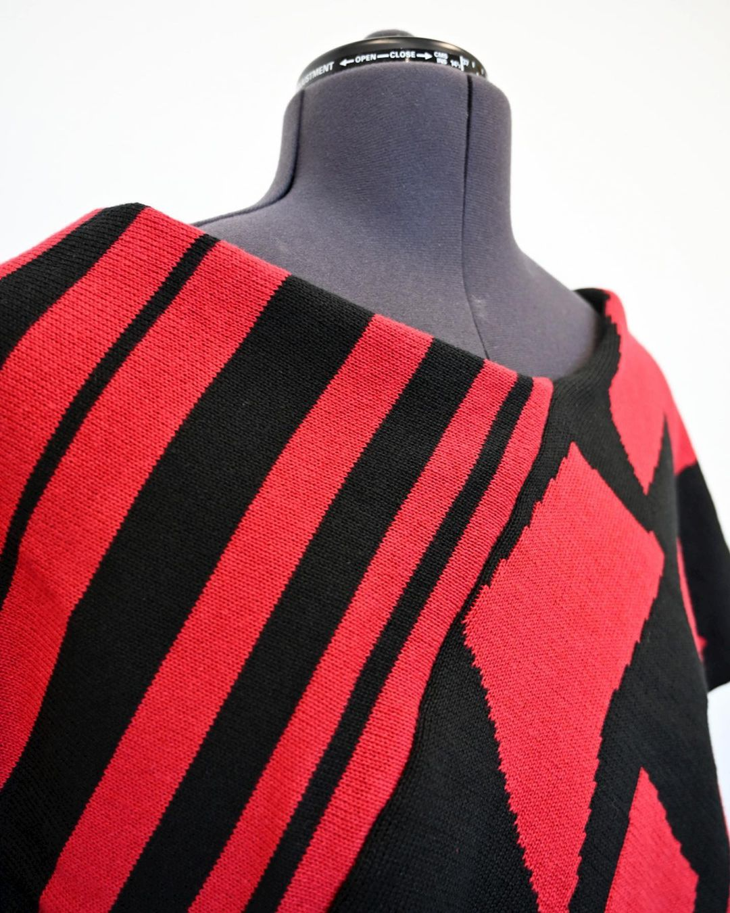
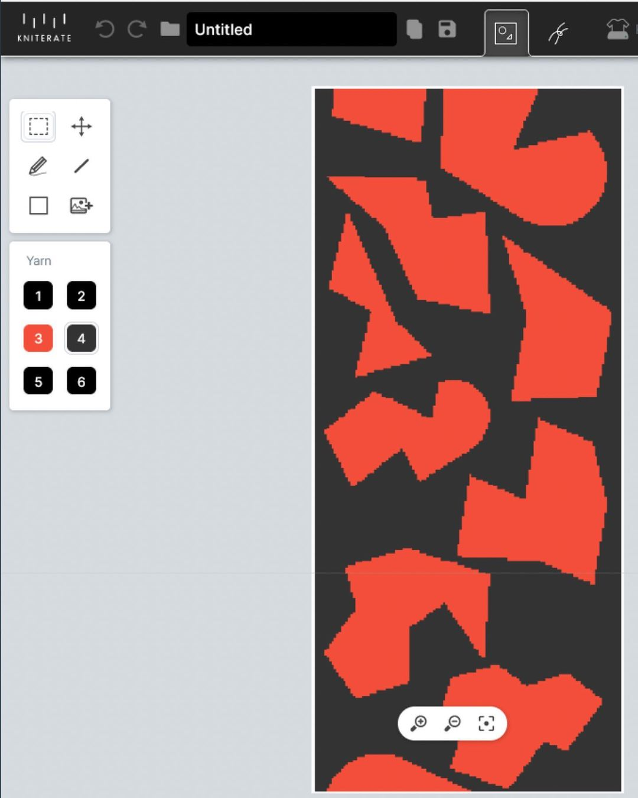
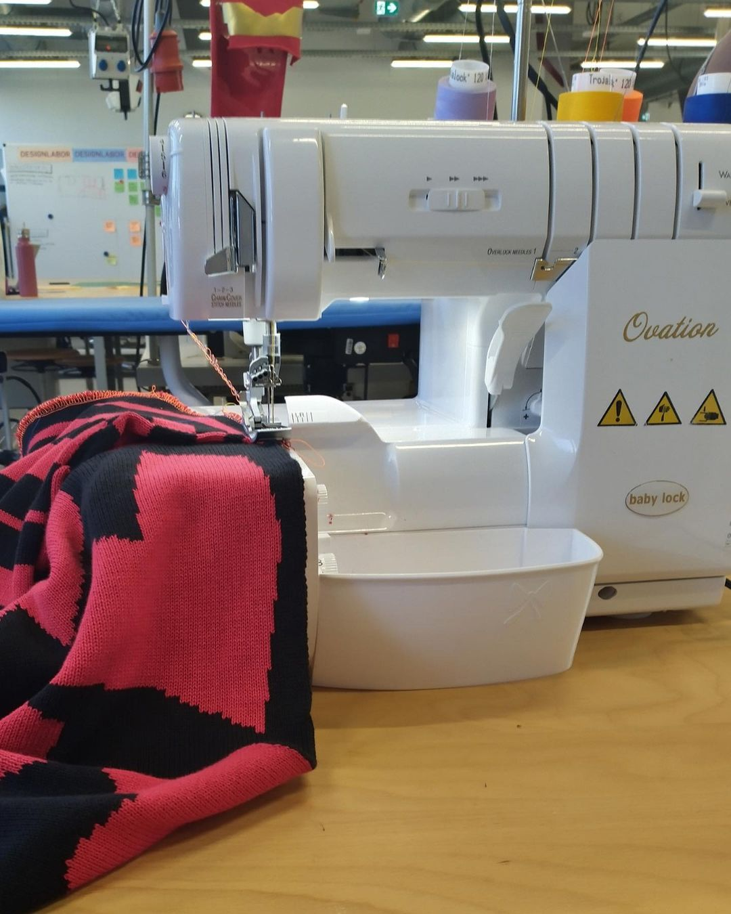
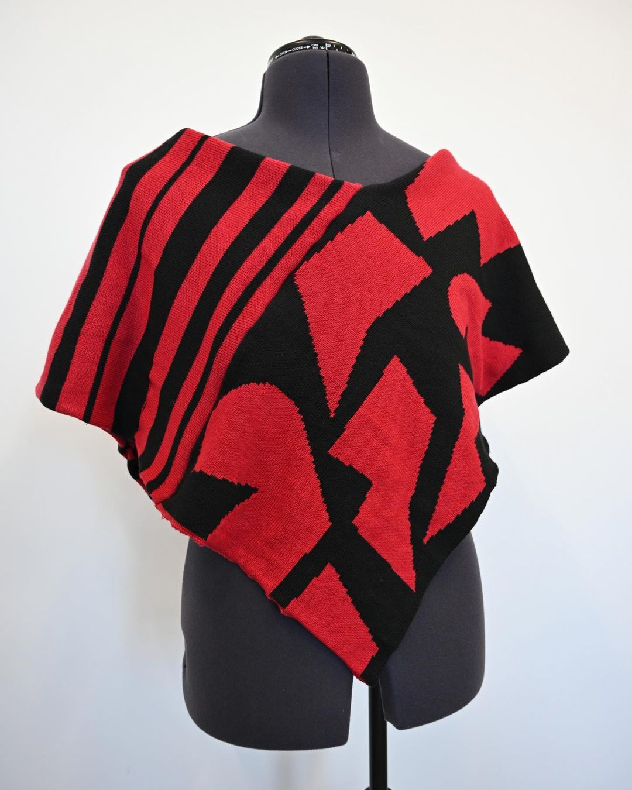

---
hide:
  - toc
date: "2023-03-23"  
authors: "LS"
---

# Ein Poncho mit unserer Kniterate 

Wie gestalte ich... einen Poncho mit der [Kniterate](../textillabor.md)?!  

Mit diesem Projekt hat sich Pia aus dem Makerspace auseinander gesetzt und für euch einen kurzen Artikel geschrieben. Viel Spaß beim lesen!

> Ich habe zuerst einen Poncho aus zwei Rechtecken entworfen. Dafür habe ich in der Kniterate-Design-App zwei Muster entworfen und mit unserer digitalen Strickmaschine - der Kniterate - gestrickt. Nach einem kurzen Test, wo ich die Rechtecke mit Sicherheitsnadeln aneinander befestigt habe, um zu gucken, dass das alles grob so aussieht, wie es soll (Tat es!), habe ich die Strickstücke mit unserem Dampfbügelcenter und einer einfachen Nadel nachbearbeitet, sprich, in Form gedämpft und die Garnenden vernäht. Zuletzt habe ich dann einen Overlockstich auf unserer Ovation Coverlock-(Näh-)Maschine benutzt, um die Rechtecke entgültig aneinander zu befestigen. Und nach ca. 5 Stunden war der Poncho mit den verschiedenen Mustern fertig!   

Falls Du nun auch Lust hast unsere Kniterate oder das Textillabor auszuprobieren, dann besuche uns doch am [Open-Makerspace](../openmakerspace.md). Melde Dich dafür vorher [hier](../kontakt.md) an. Falls Du noch nie bei uns warst, solltest Du zu aller erst einen Termin für die [Allgemeine Sicherheitsunterweisung](../anmeldung-siu.md) bei uns ausmachen.

{ width="45%" }
{ width="45%" }
{ width="45%" }
{ width="45%" }

