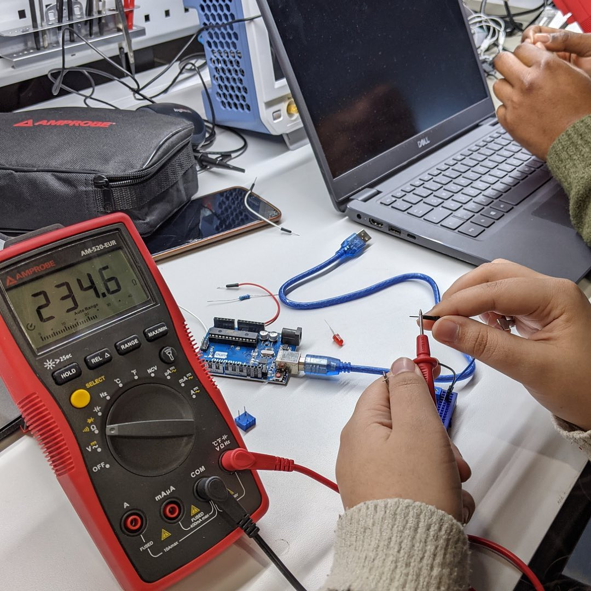
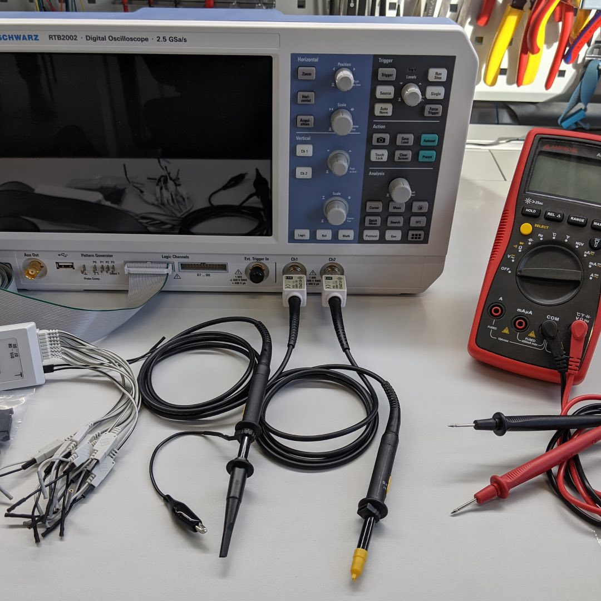

---
hide:
  - toc
date: "2023-04-03"  
authors: "LS"
---

# Messgeräte im Digitallabor 

Überprüfe deine Prototypen...  

mit Hilfe von unseren hochqualitativen Messgeräten wie zum Beispiel den Oszilloskopen von @rohdeschwarzusa oder unseren Multimetern von @amprobetools in unserem [Digitallabor](../digitallabor.md).

{ width="45%" }
{ width="45%" }
{ width="45%" }

