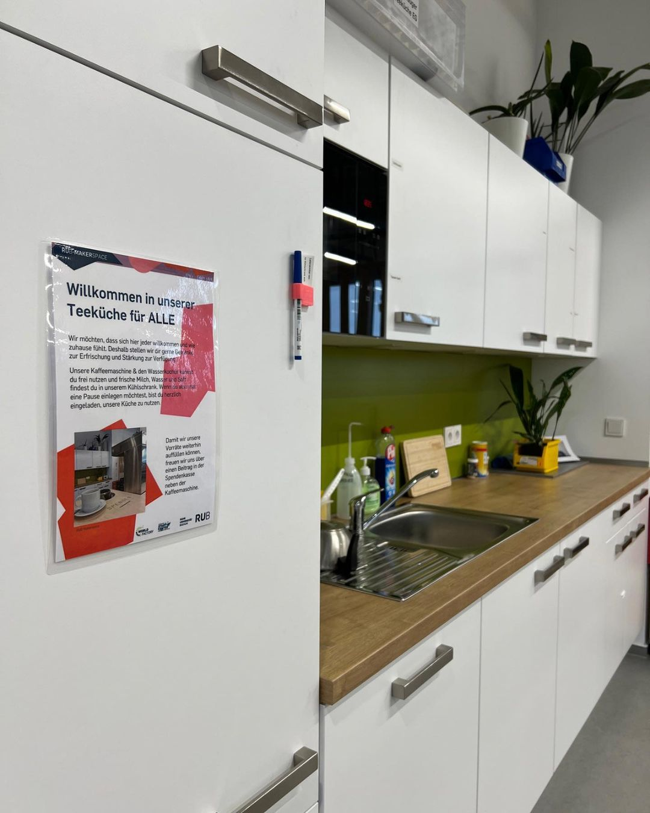

---
hide:
  - toc
date: "2023-04-11"  
authors: "LS"
---

# Unsere Teeküche für Dich

Willkommen in unserer [Teeküche](../coworking.md#teekuechen) für ALLE!  

Wir möchten, dass sich hier jede\*r willkommen und wie zu Hause fühlt. Deshalb bieten wir Dir gerne Getränke zur Erfrischung und Stärkung an.  

Unsere Kaffeemaschine und der Wasserkocher stehen Dir zur Verfügung und in unserem Kühlschrank findest Du frische Milch (auch vegan), Wasser und Saft. Wenn Du also eine Pause einlegen möchtest, bist Du herzlich eingeladen, unsere Küche zu benutzen.  

Damit wir unsere Vorräte wieder auffüllen können,  
freuen wir uns über jeden Beitrag in der [Spendenkasse](../unterstuetzung.md#barspenden) neben der Kaffeemaschine.

{ width="45%" }
{ width="45%" }
{ width="45%" }

