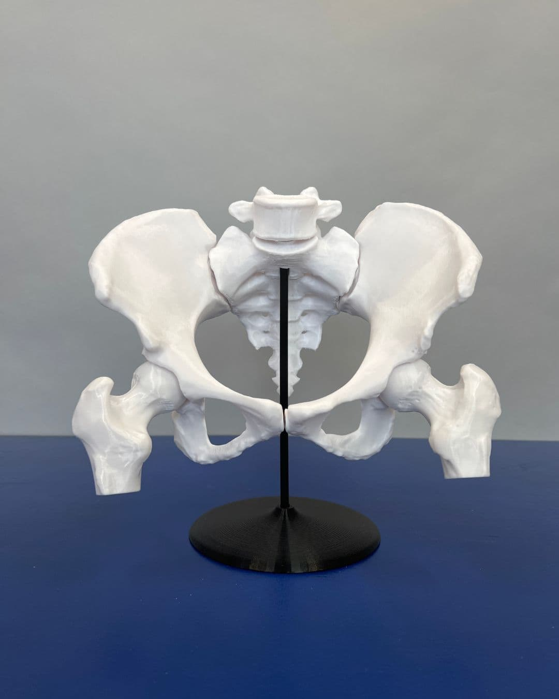
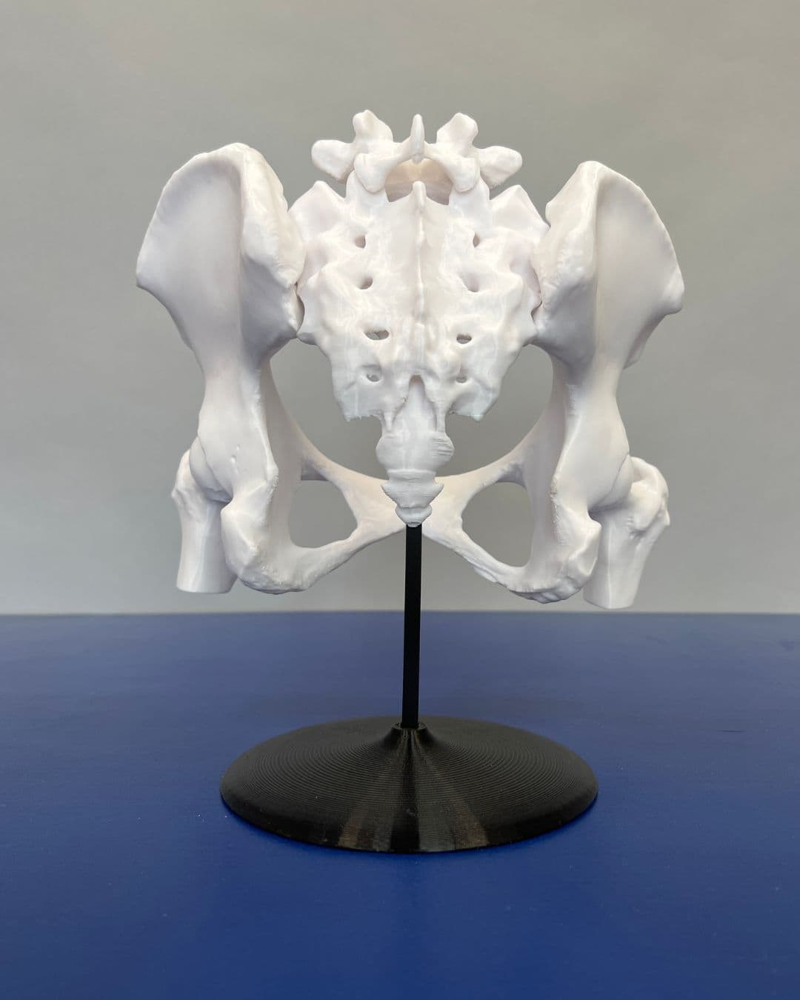
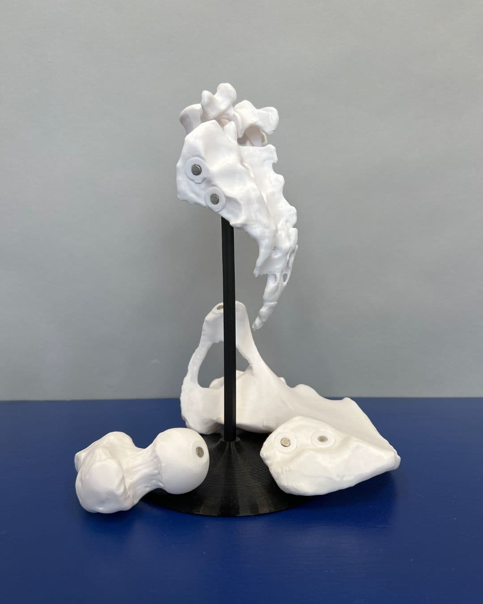
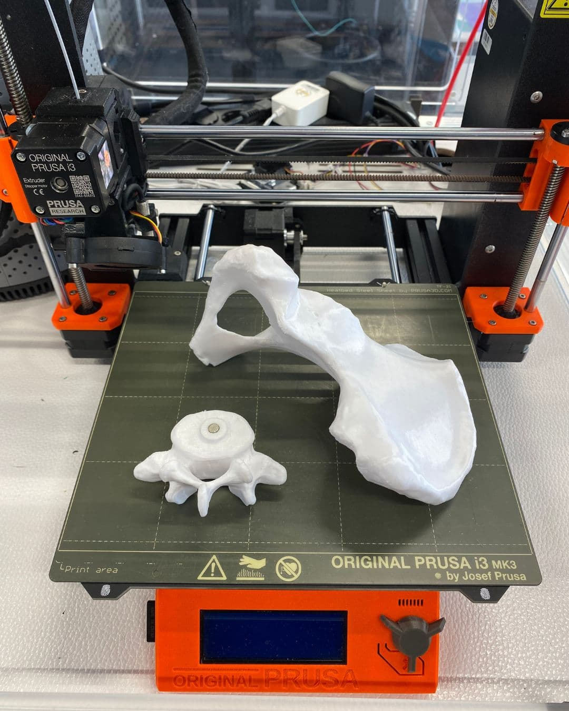

---
hide:
  - toc
date: "2023-05-07"  
---

# Was 3D-Druck so kann...

Zur Veranschaulichung und Unterstützung bei der Hebammen-Ausbildung hat Richard ein lebensgroßes Beckenknochenmodell einer Frau, mit unserem 3D-Drucker gestaltet. Er arbeitet sehr gern hier im Makerspace, da er bei uns die Möglichkeit hat, nach einer Sicherheitsunterweisung und Einweisung, frei mit den Geräten zu arbeiten.

Wie er bei diesem Projekt vorgegangen ist, könnt ihr hier lesen:
"Zuerst habe mir ein frei zugängliches Modell aus dem Internet bei "Thingiverse" heruntergeladen. Das Modell besteht aus mehreren Einzelteilen, die am Ende noch zusammengefügt werden können. 
Im Anschluss habe ich dann aus PLA Filament alle Teile auf einem @josefprusa 3D-Drucker gedruckt.
Um die einzelnen Teile nach dem Druck zusammenzufügen, klebte ich in die Verbindungsstellen kleine Magnete. Dadurch kann das Modell beliebig oft auseinander- und wieder zusammengebaut werden. 
Insgesamt betrug die Druckzeit ca. 50 Std. bei einer Schichtdicke von 0,2 mm."

{ width="45%" } { width="45%" } { width="45%" } { width="45%" } 