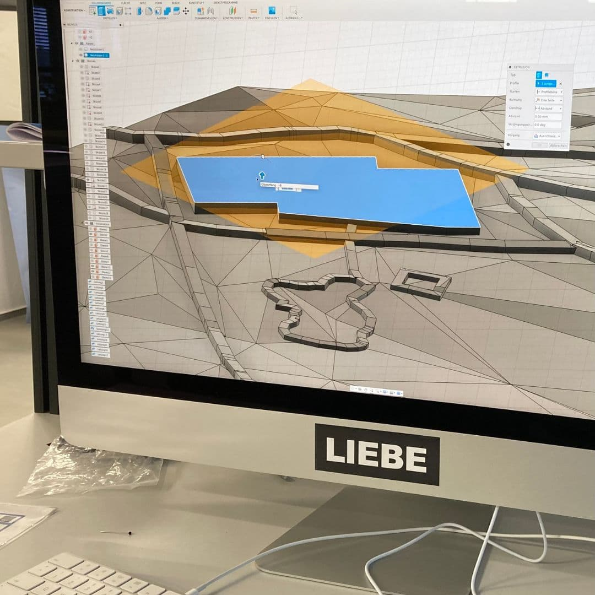

---
hide:
  - toc
date: "2023-05-21"  
---

# Von einer Idee bis zur Bachelorarbeit

Mit diesem Grundgedanken war @f.r.a.n.c.e.s_w bei uns im Makerspace und gestaltete ein taktiles Umgebungsmodell für sehbehinderte Menschen. 
Wie ihre Arbeit bei uns aussah lest ihr in diesem Beitrag.

"In der Möglichermacher-Werkstatt des RUB-Makerspace konnte meine Projektidee erfolgreich umgesetzt und die Grundlage meiner Bachelorarbeit geschaffen werden.
Dank der Expertise und des Engagements von Oliver Stickel und Jan Schäfer sowie der Werkstattausrüstung des Makerspace konnte dort vor Ort ein Prototyp einer mobilen 3D-gedruckten Karte von einem Wittener Gebiet, dem Hohenstein, entwickelt und anschließend auf dem 3D-Drucker im FDM-Verfahren gedruckt werden. Dieser Prototyp diente als taktiles Umgebungsmodell, welches von blinden und hochgradig sehbehinderten Menschen ertastet und auf seine Tauglichkeit getestet werden konnte- mit Erfolg!
Die Testpersonen profitier(t)en vielfältig von solch einer mobilen 3D-gedruckten Karte, was die Forschungsergebnisse der Bachelorarbeit zeigen."

Wenn auch du jetzt begeistert bist und gerne bei uns arbeiten möchtest, dann melde dich per Mail an makerspace@rub.de. Unser Open Makerspace ist immer dienstags und donnerstags von 10-16 Uhr und jeden 2. Donnerstag des Monats von 16-20Uhr.

{ width="45%" } { width="45%" } { width="45%" } { width="45%" } 