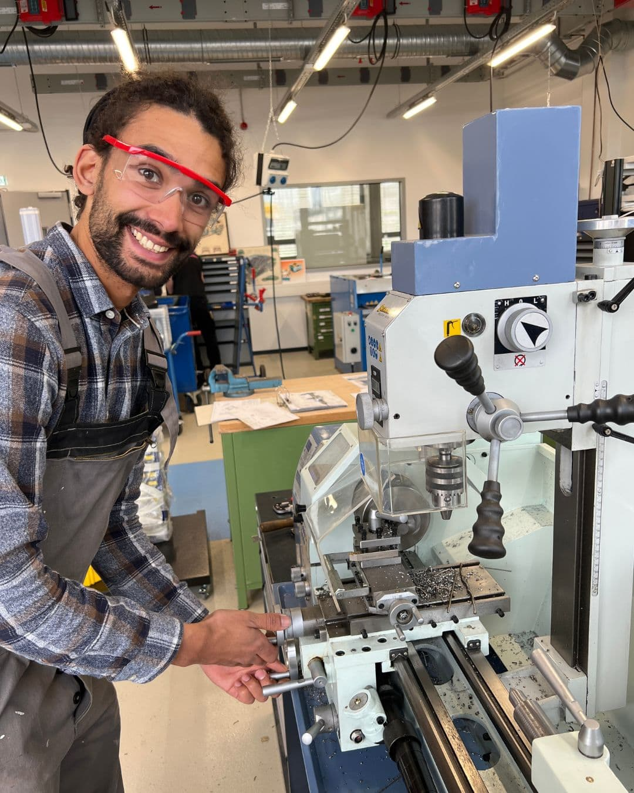
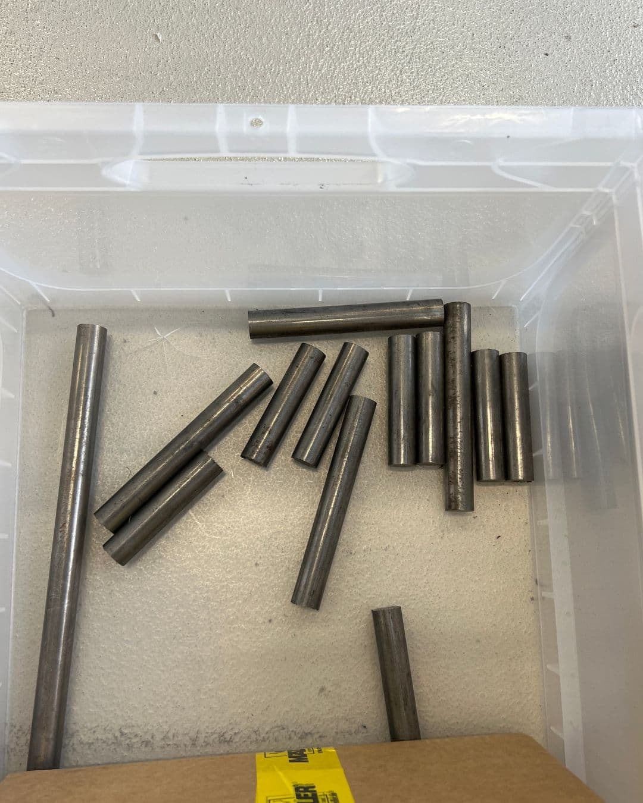

---
hide:
  - toc
date: "2023-06-05"  
---

# Just do it! 

Moses von carcamper hat bei uns eine Prototypen-Maschine für die Serienproduktion entworfen und gebaut. Er bietet in seinem Unternehmen verschiedene Module für den Umbau eines Autos in einen Camper an, damit campen im eigenen Auto einfacher und für jeden möglich ist.

Durch sein großes handwerkliches Vorwissen, welches er unter anderem in einer Ausbildung gelernt hat, konnte er nach unseren Sicherheitsunterweisungen in die Maschinen direkt mit der Arbeit loslegen.  

Aufgrund der leichten Zugänglichkeit des Makerspace und der qualitativen Ausstattung auf Industriestandard hat sich Moses für die Umsetzung seines Projektes bei uns entscheiden.

Cool, dass du bei uns warst, Moses!

{ width="45%" } { width="45%" } 