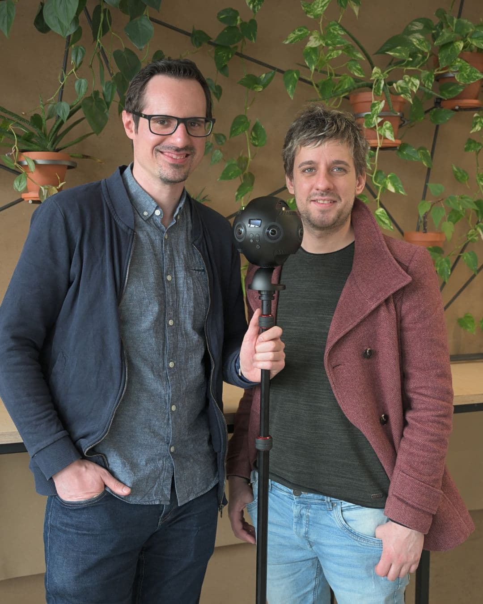

---
hide:
  - toc
date: "2023-06-20"  
---

# 360° Video-Aufnahmen 

Marco und Simon von dem LWL-Universitätsklinikum der Ruhr-Universität Bochum aus der Forschungsabteilung für Experimentelle Psychopathologie waren in den letzten Wochen bei uns. 
Sie nutzen die Insta360 Pro 2-Kamera, um Videos für ein Forschungsprojekt zu erstellen.
Mit ihrer Forschung möchten sie mehr über den Einfluss der Lebenswelt auf die psychische Gesundheit herausfinden.

Marco und Simon erstellen Videos und optimieren diese für die spätere Anzeige in der Virtuellen Realität. Die Insta360 Pro 2 nimmt gleichzeitig sechs Videos auf, die dann mit einer speziellen Software, dem Insta360 Stitcher, zu einem 360°-Video zusammengefügt werden. Diese Software hält zudem viele weitere Einstellungsmöglichkeiten bereit.

Wir haben sie gefragt warum sie das Projekt bei uns umsetzen und nicht woanders und das war ihre Antwort:
"Wir sind froh über das Angebot im Makerspace, da wir dadurch die Kamera nicht selbst anschaffen müssen. Das entlastet unser Forschungsbudget, von dem wir entsprechend mehr für andere Kostenpunkte einsetzen können (z.B. Aufwandsentschädigungen für Proband:innen)."

{ width="45%" } { width="45%" } { width="45%" } 