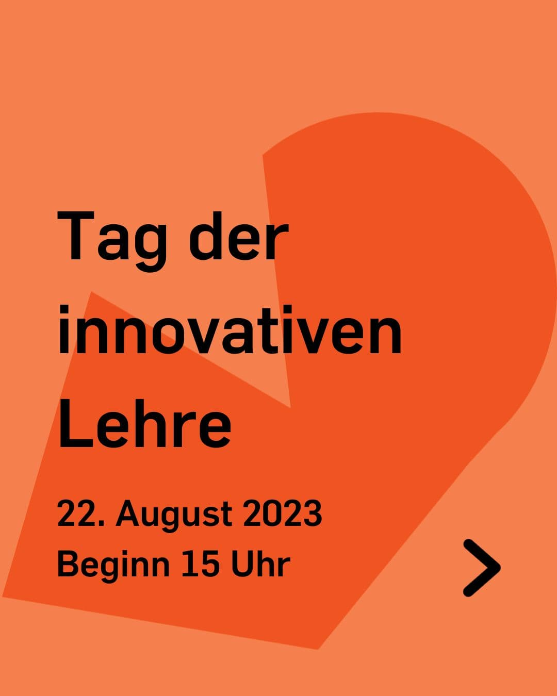
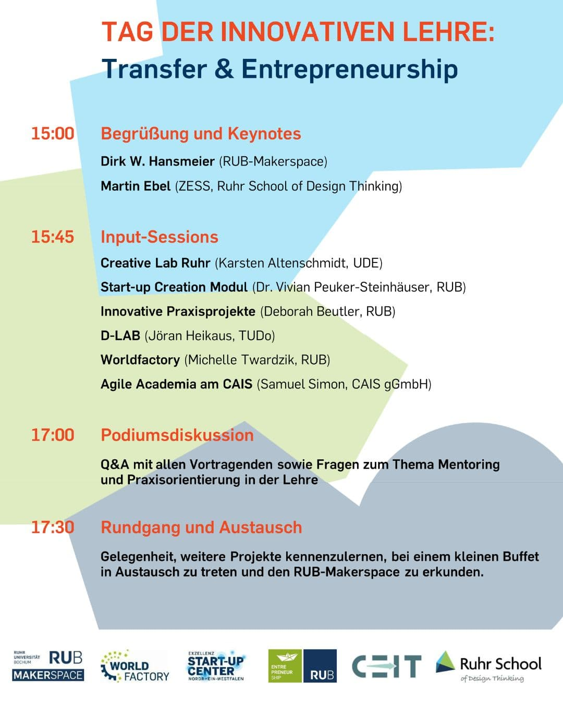

---
hide:
  - toc
date: "2023-08-04"  
---

# Lehrende aufgepasst! 

Am 22.08. findet bei uns im Makerspace der zweite Tag der innovativen Lehre statt! 

Ab 15 Uhr kannst du dich auf spannende Vorträge verschiedenster Einrichtungen mit Best Practice Beispielen freuen. Einer Podiumsdiskussion mit Q&A aller Speaker und Fragen zum Thema Mentoring & Praxisorientierung in der Lehre lauschen. Und im Anschluss die Gelegenheit nutzen, weitere Projekte kennenzulernen, bei einem kleinen Buffet in Austausch zu treten und den Makerspace zu erkunden. 

Wir freuen uns auf dich! 

@worldfactory @ruhrunibochum @caisnrw @tu_dortmund @uni_duisburg_essen @isse.bochum

{ width="45%" } { width="45%" }  