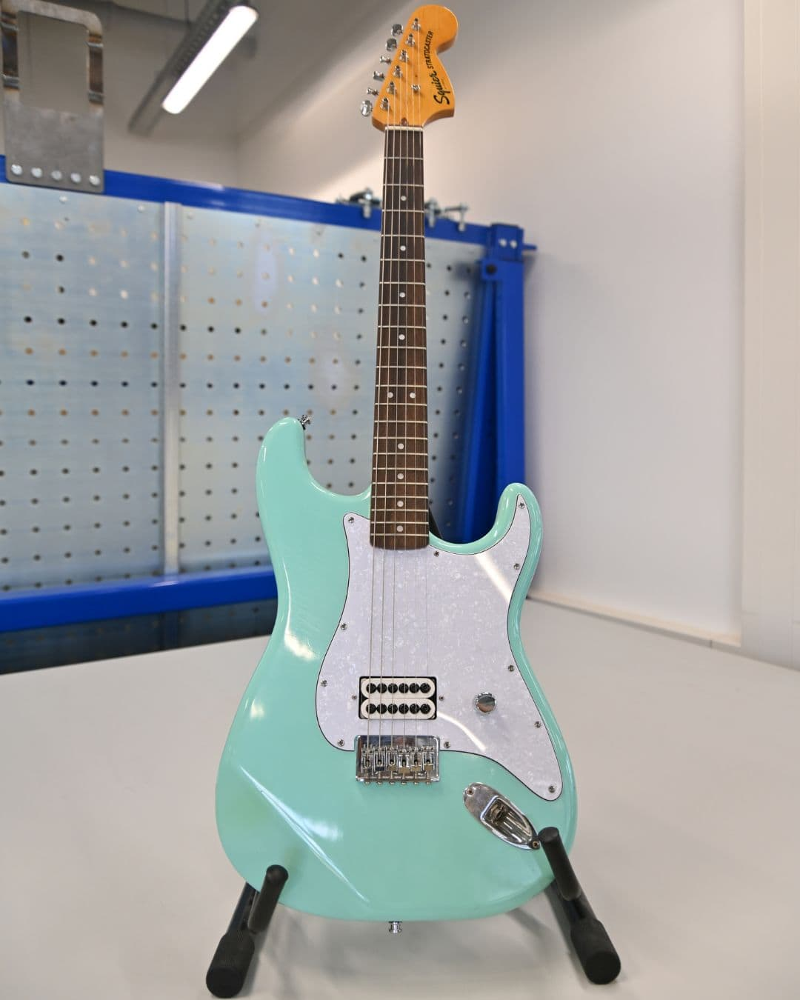
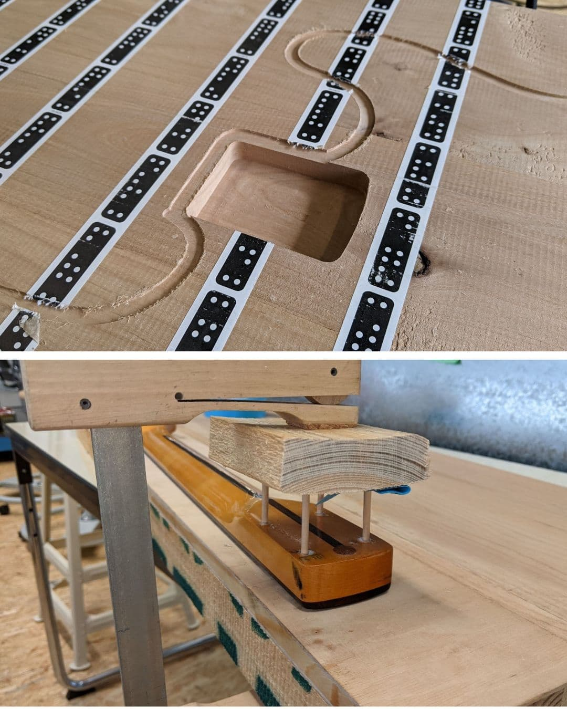
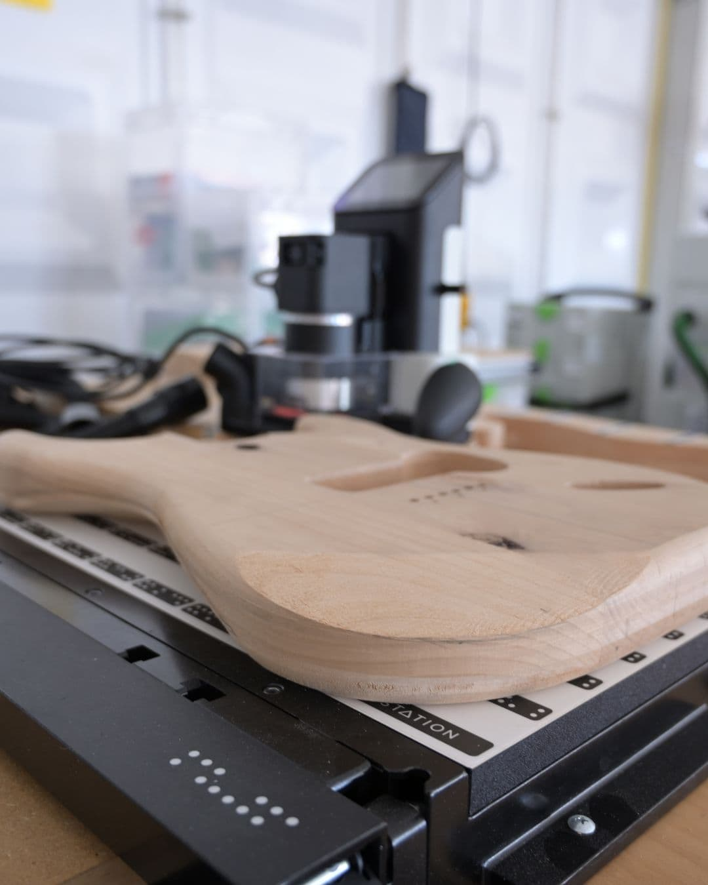
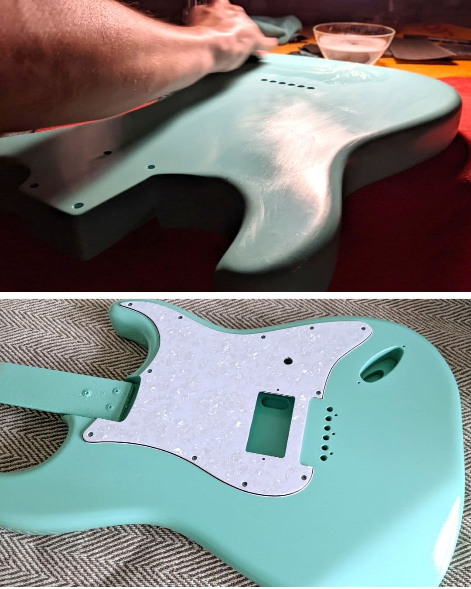
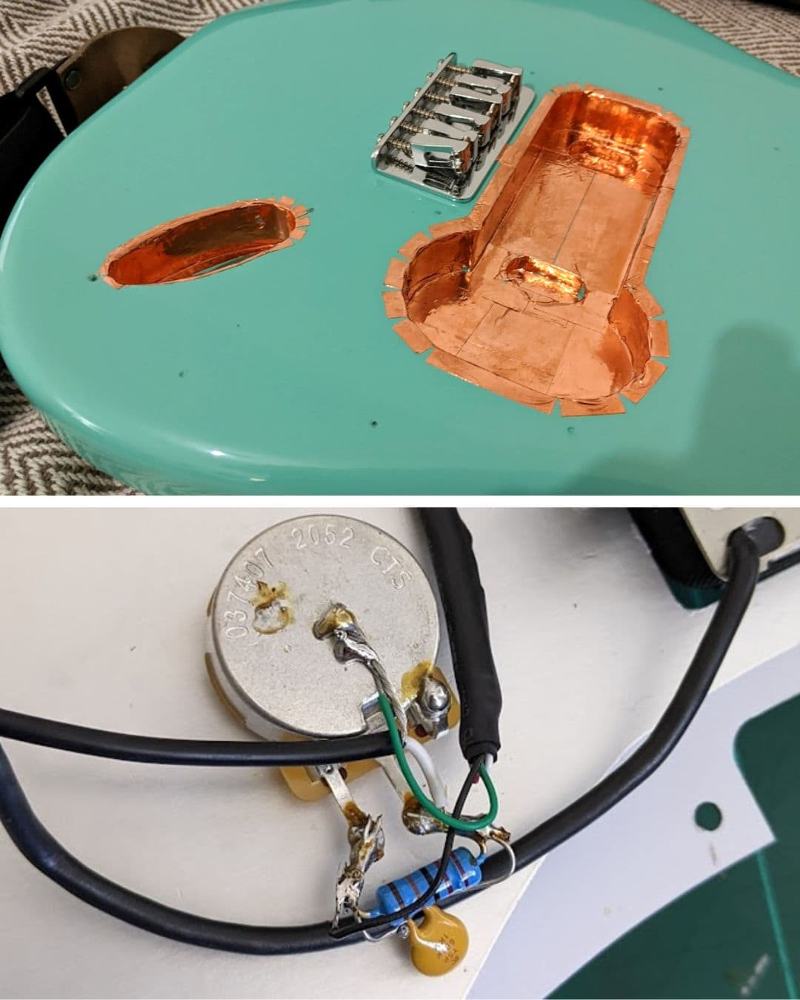

---
hide:
  - toc
date: "2023-08-16"  
---

# So baust du deine eigene E-Gitarre 🎸

Ein Maker hat sich den Traum einer eigenen E-Gitarre, nach dem Vorbild einer Fender Stratocaster, erfüllt. 
Lies hier, wie er dabei vorgegangen ist.
Um den Holzkorpus zu fräsen, musste zuerst eine Vektorgrafik erstellt werden, wofür Inkscape benutzt wurde. 
Der Korpus wurde aus 3 Teilen kanadischer Roterle zusammengeleimt. Danach wurden die Form, die Taschen und die Aufnahme für den Hals, mit der Origin, aus der großen Holzplatte ausgefräst. Die Rundungen und Freiformflächen wurden mit einer Oberfräse und einem Winkelschleifer, aus unserer Holzwerkstatt, gefertigt.
Der Hals der Gitarre wurde gebraucht dazu gekauft und für die Montage am Korpus aufgearbeitet. 
Zum Testen des Sitzes vom Hals im Korpus wurden die einzelnen Teile zunächst probehalber zusammengebaut. 
Im nächsten Schritt wurde der Korpus in mehreren Schichten lackiert. Dabei kamen ein Porenfüller, eine Grundierung, ein weißer Basislack und der Hochglanzlack in der Farbe Surf Green zum Einsatz.
Da erst nach dem Polieren die Hochglanzoptik des Lacks entsteht, wurde nach dem Trocknen aller Schichten fleißig geschliffen und poliert.
Bevor der Tonabnehmer eingesetzt werden konnte, musste vorher noch die Aussparung mit Kupferfolie ausgekleidet werden, damit Störsignale aus der Umgebung abgeschirmt werden. 
Zum Schluss mussten nur noch die elektrischen Schaltungen verlötet werden. Dazu verbindet man den Tonabnehmer über ein Lautstärkenpotentiometer mit der Signalausgabebuchse. 

Und "schon" ist die eigene E-Gitarre fertig! 

{ width="45%" } { width="45%" } { width="45%" } { width="45%" } { width="45%" } 