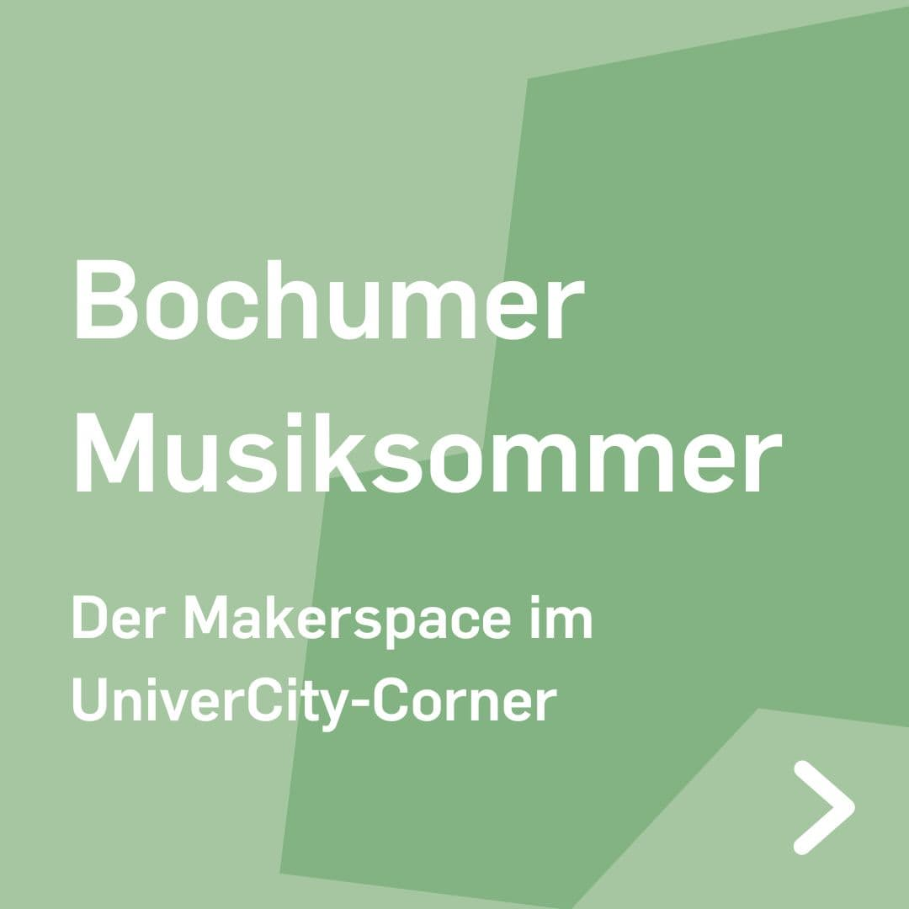

---
hide:
  - toc
date: "2023-08-23"  
---

# Bochumer Musiksommer

Wir sind dabei! 

Komm vorbei, tausch Dich aus und mach mit! 
Wir sind am Freitag den 25. August von 14 Uhr bis 20 Uhr an der Huestraße Ecke Hellweg im UniverCity-Corner und geben Dir einen Einblick in die Arbeit und die Projekte des Makerspace.

{ width="45%" } ![weiße Schrift auf grünem Hintergrund- Wir sind dabei! Vom 25. bis 27. August findet der Bochumer Musiksommer statt. "Klassik, elektronische Tanzmusik, Chormusik, Jazz und vieles mehr erwarten die Besucher. Mehrere Bühnen und weitere Spielorte verteilen sich in der Innenstadt."(Bochum Marketing GmbH) Wir und viele weitere Organisationen sind im Univercity Corner und bringen Wissenschaft in die Innenstadt. Mit dabei sind u.a. Hochschule Bochum, IHK Bochum, Fraunhofer IEG und die Evangelische Hochschule.](../medien/2023-08-23b.jpg){ width="45%" } ![weiße Schrift auf grünem Hintergrund - Du hast eine Produktidee, bist Gründer: in oder möchtest einfach mal etwas Neues lernen und ausprobieren, doch dir fehlen die Geräte, der Platz und das Know-How? Kein Problem! Im mobilen Makerspace der Ruhr-Universität Bochum kannst du mit dem Team in Austausch treten, dir 3D-Druck als Prototyping-Verfahren zeigen lassen und entdecken, wie eine computergesteuerte Stickmaschine in wenigen Minuten kleine Designs auf Textilien stickt. Der RUB-Makerspace hilft dir dabei deine Ideen in die Tat umzusetzen und einfach ins „Machen“ zu kommen. Wo und wann? Am Freitag von 14 bis 20 Uhr im UniverCity-Corner (Huestraße Ecke Hellweg).](../medien/2023-08-23c.jpg){ width="45%" } 