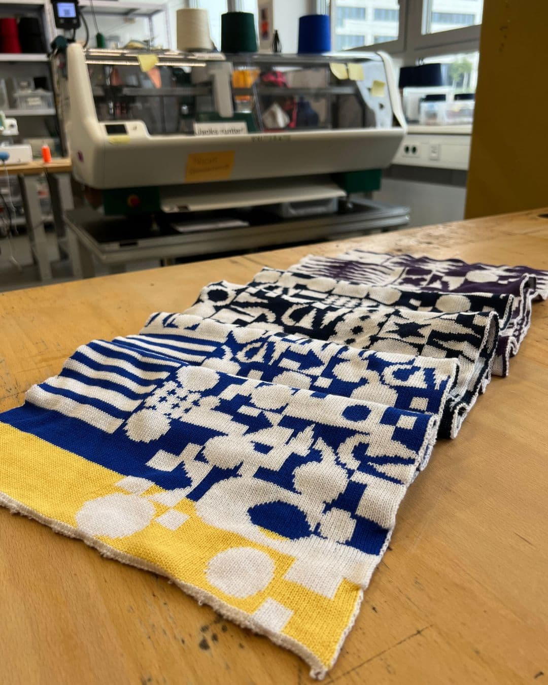

---
hide:
  - toc
date: "2023-09-06"  
---

# Patient 01034063 Datenschal

Die Arbeit von Janneke Sander (@jannekekd) entstand in dem Kurs "Everything is data?" im Grafikdesign Studium der FH Dortmund. Das Projekt PATIENT 01034063 DATENSCHAL ist eine spielerische Auseinandersetzung mit dem Thema Datenschutz, speziell in der Medizin. Außerdem werden die Informationen des Inneren, außen gezeigt. 

Das Muster ergibt sich aus den Daten, so sind Diagnosen zum Beispiel in vier Quadraten dargestellt, Blutbilder ergeben ein Streifenmuster und die ethnische Herkunft spiegelt sich in der Farbwahl. 

Der Schal wurde mit unserer computergesteuerten Strickmaschine gestrickt und wenn Du nun auch Lust hast bei uns im Textiellabor zu arbeiten, dann melde Dich doch für den Open Makerspace an! 
Wir haben Dienstag und Donnerstag von 10 - 16 Uhr und jeden zweiten Donnerstag im Monat von 16 - 20 Uhr geöffnet. Der nächste Late Makerspace findet nächste Woche am 14.09.2023 statt.

{ width="45%" } { width="45%" } { width="45%" } { width="45%" }