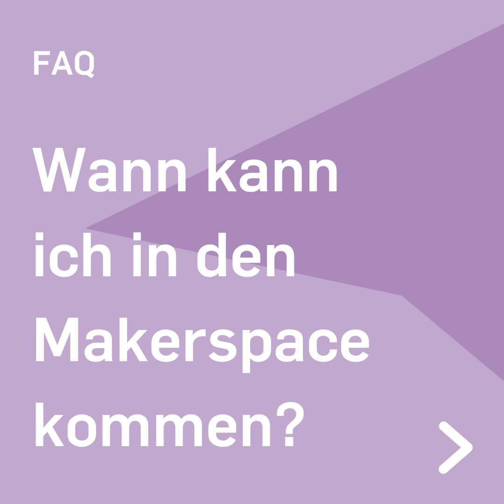

---
hide:
  - toc
date: "2023-09-15"  
---

# Öffnungszeiten Makerspace!

Am Dienstag und Donnerstag findet von 
10 Uhr bis 16 Uhr der Open Makerspace statt.

Zusätzlich dazu gibt es immer am 2. Donnerstag im Monat einen Late Makerspace. 
An diesem Tag kannst Du zwischen 14 Uhr und 20 Uhr zu uns kommen.

Bitte melde Dich vorher mit einem Terminwunsch per Mail unter makerspace@rub.de an. 
Dann können wir Dich und Dein Projekt bestmöglich unterstützen!

Wir freuen uns auf Deinen Besuch!

{ width="45%" } { width="45%" }