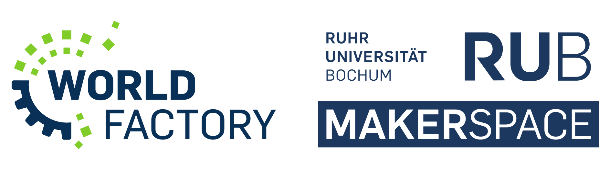
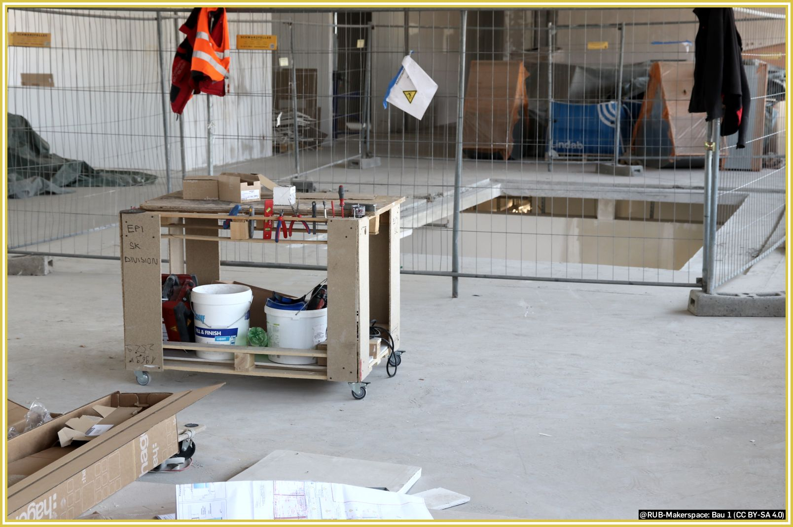
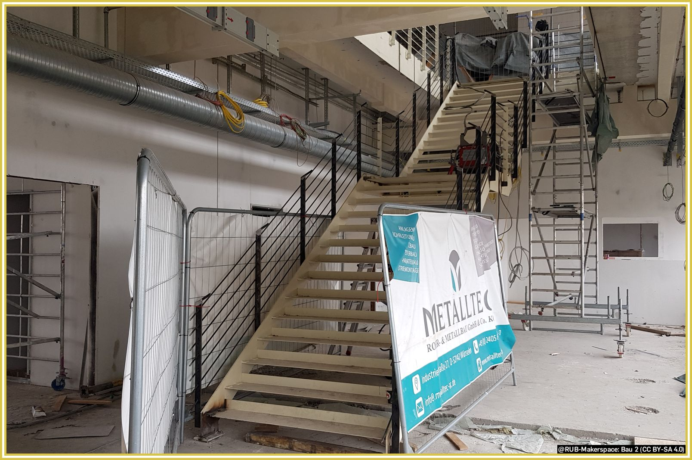
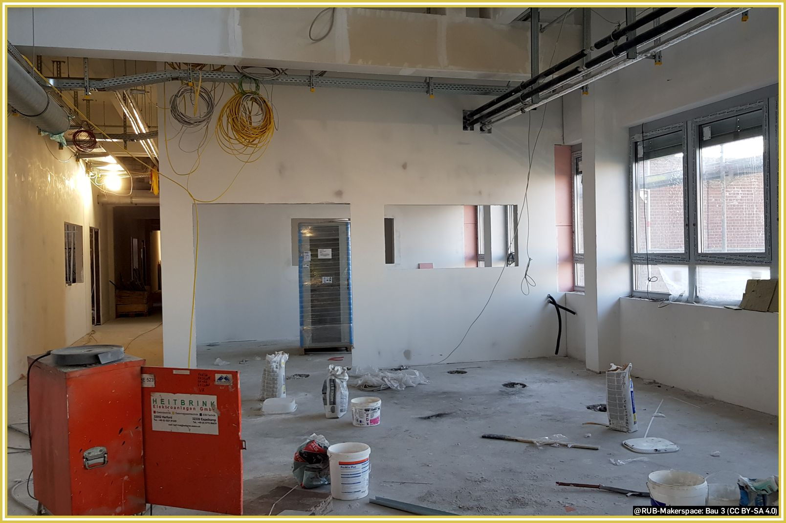

# Organization

The [Ruhr-Universität Bochum](https://www.ruhr-uni-bochum.de/en) is one of the leading research universities in Germany. As a reform-oriented campus university, it combines the entire range of major scientific fields in one place. The dynamic coexistence of disciplines and cultures offers researchers and students alike special opportunities for interdisciplinary cooperation.  

The RUB Makerspace is part of the [Worldfactory](https://www.worldfactory.de/en/) and thus located in the university administration in the **[Department of University Development and Strategy](https://einrichtungen.ruhr-uni-bochum.de/en/department-1-university-development-and-strategy) or, respectively, located there in the [Department of Transfer and Entrepreneurship](https://einrichtungen.ruhr-uni-bochum.de/en/node/397).**

## A Makerspace as a Central Offer of the Rub.

Already years ago, the RUB articulated the desire to create an innovative, transfer and practice-oriented place as a central offer - the foundation stone for the RUB Makerspace. By locating it in the administration, it was intended to emphasize both that this is a central offering and that the project has a certain strategic importance for the Ruhr-Universität.  

With this orientation, the RUB is in line with the nationwide trend of providing Makerspaces, Fab Labs and similar places for its students, teachers, researchers and employees. Nevertheless, there is an effort to make this place accessible to the general public as well, as far as our resources allow. 
Basically, we strive for a demand-driven organizational development, where we continuously develop the Makerspace according to the needs of the users. 

## Pre-project 'MakerForum'

A few years ago, the RUB realigned its transfer area and launched the umbrella concept ["Worldfactory"](https://www.worldfactory.de/en/). Since then, new forms of cooperation between business and science, specific support for student projects and practice-oriented teaching, and start-up activities have been bundled and promoted under this label. As a first step on the way to an extensively equipped Makerspace, the so-called MakerForum was established in this course, which served the preparation and operational testing of today's Makerspace. It was operated for a few semesters in the University Forum East, the so-called UFO on campus.  

## Establishment of the RUB Makerspace as part of the 'Worldfactory Start-up Center' {: #worldfactory }

Since 2019, RUB has been receiving project funds from the Ministry of Economics of the State of NRW to expand its start-up activities within the framework of an ['Excellent Start-up Center.NRW'](https://www.exzellenz-start-up-center.nrw/). This is currently being done specifically within the projects Worldfactory Start-up Center and Worldfactory International. Funding will continue until the end of 2024; the Makerspaces is the largest sub-project of the [Worldfactory Start-up Center](https://www.worldfactory.de/en/).  

To date, we have come a long way and it is still ongoing. Despite the pandemic and delays in construction, we are confident that we will be able to operate the Makerspace fully by the end of our funding. After the state funding, the project will be continued by the Ruhr-University.

Here are a few impressions since we moved into the so-called O-Werk on Mark 51°7 in November 2020:

###Construction of the EG

###Construction of the basement and the staircase

###Construction of the UG, view into the ceramic workshop

###Delivery of the large FDM printer

## The Long-term Perspective

The university also values a clear perspective that goes beyond the project. The decision to locate not only the RUB Makerspace and other transfer-related RUB facilities on [Mark 51°7](https://www.mark51-7.de/), but also research buildings and comparable facilities, consistently follows the three-pole [Campus Development](https://uni.ruhr-uni-bochum.de/en/campus-development). This long-term strategic decision is intended to achieve synergies of technology-oriented top-level research in exchange with the essential transfer facilities.

The RUB's strong commitment to the [location Mark 51°7](https://www.mark51-7.de/en/) and its business-promoting engagement underline this objective. The infrastructural upgrading of the building made possible by the project funding is the first and most important step towards a long-term continuation of the 'RUB-Makerspace' project.