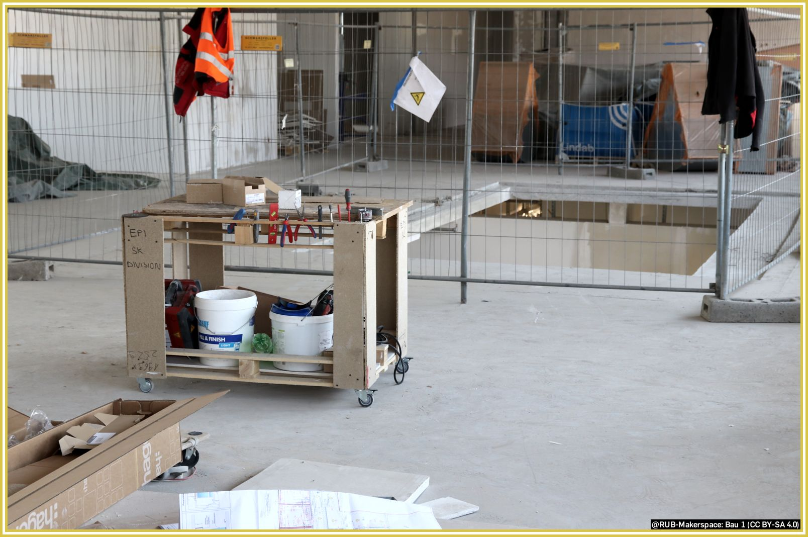
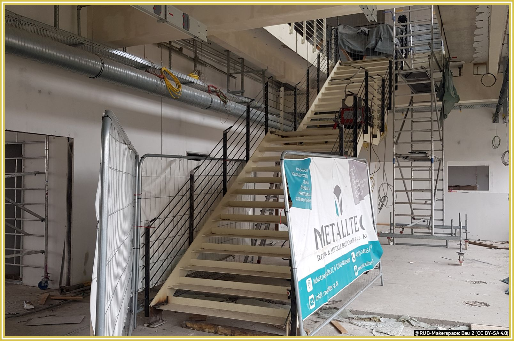
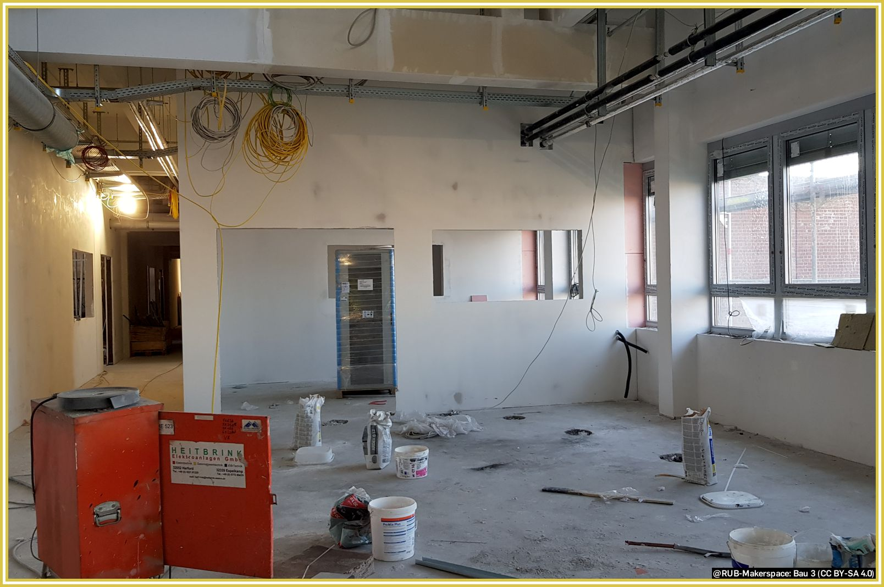
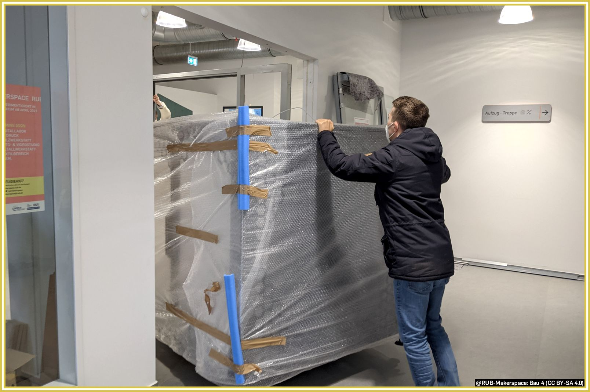

# Die Organisation

## Verortung in der Universität

Die [Ruhr-Universität Bochum](https://www.ruhr-uni-bochum.de/de) ist eine der führenden Forschungsuniversitäten in Deutschland. Als reformorientierte Campus-Universität vereint sie die gesamte Spannbreite der großen Wissenschaftsbereiche an einem Ort. Das dynamische Miteinander von Fächern und Fächerkulturen bietet den Forschenden wie den Studierenden gleichermaßen besondere Chancen zur interdisziplinären Zusammenarbeit.  

Der RUB-Makerspace und sein [Team](team.md) gehören zum Transfer- und Gründungscenter [**WORLD**FACTORY](https://www.worldfactory.de) und sind somit Teil einer Zentralen Betriebseinheit der RUB.

## Kontext und Geschichte

Bereits vor Jahren hat die RUB den Wunsch artikuliert, einen innovativen, transfer- und praxisorientierten Ort als zentrales Angebot zu schaffen – der Grundstein für den RUB-Makerspace. Mit der damaligen Verortung in der Universitätsverwaltung sollte sowohl deutlich gemacht werden, dass es sich hier um ein zentrales Angebot handelt, als auch, dass das Vorhaben eine gewisse strategische Bedeutung für die Ruhr-Universität hat.  

Mit dieser Ausrichtung entspricht die RUB dem bundesweiten Trend Makerspaces, Fab Labs und ähnliche Orte für ihre Studierenden, Lehrenden, Forschenden und Beschäftigten bereitzustellen. Gleichwohl gibt es die Bestrebung, diesen Ort auch der Allgemeinheit zugänglich zu machen, sofern unsere Ressourcen dies zulassen. 

Grundsätzlich wird eine nachfrageorientierte Organisationsentwicklung angestrebt, bei der wir den Makerspace auf die Bedarfe der Nutzenden hin stetig weiterentwickeln. 

### Ab 2023: Zentrale Betriebseinheit '**WORLD**FACTORY'

Eine klare Perspektive über das (Aufbau-)Projekt [Worldfactory Start-up Center](#worldfactory) hinaus ist der Hochschule wichtig. Die Entscheidung auf [Mark 51°7](https://www.mark51-7.de/) nicht nur den RUB-Makerspace und weitere transfernahe Einrichtungen der RUB anzusiedeln, sondern auch Forschungsbauten und vergleichbare Einrichtungen, folgt konsequent der dreipoligen [Campusentwicklung](https://uni.ruhr-uni-bochum.de/de/campusentwicklung). Mit dieser langfristigen strategischen Entscheidung sollen Synergien der technologieorientierten Spitzenforschung im Austausch mit den wesentlichen Transfereinrichtungen erzielt werden.  

Im Herbst 2023 ist aus dem Projekt "Worldfactory Start-up Center" das Transfer- und Gründungscenter [**WORLD**FACTORY](https://www.worldfactory.de) als eigene [Zentrale Betriebs-Einheit](https://de.wikipedia.org/wiki/Ruhr-Universit%C3%A4t_Bochum#F%C3%A4cher%C3%BCbergreifende_Einrichtungen) entstanden und damit als permanente Struktur an der RUB verstetigt. 

### Ab 2019: Aufbau des Makerspace als Teil des 'Worldfactory Start-up-Center' {: #worldfactory }

Seit 2019 erhält die RUB Projektgelder vom Wirtschaftsministerium des Landes NRW, um ihre Gründungsaktivitäten im Rahmen eines ['Excellent Start-up Center.NRW'](https://www.exzellenz-start-up-center.nrw/) auszubauen. Dies geschieht aktuell konkret innerhalb der Projekte Worldfactory Start-up-Center und Worldfactory International. Die Förderung erfolgt noch bis Ende 2024; der Makerspace ist das größte Teilprojekt des [Worldfactory Start-up-Centers](https://www.worldfactory.de/).  

Bis zum heutigen Tag haben wir einen langen Weg zurückgelegt, der noch immer nicht abgeschlossen ist. Trotz Pandemie und baulicher [Verzögerungen](wasserschaden.md), sind wir aber frohen Mutes bis Ende unserer Förderung den Makerspace umfänglich zu betreiben. Im Anschluss an die Landesförderung soll das Vorhaben durch die Ruhr-Universität verstetigt werden.

Der Aufbau des Worldfactory Start-up-Center war bis 2023 angesiedelt am [Dezernat für Hochschulentwicklung und Strategie](https://einrichtungen.ruhr-uni-bochum.de/de/dezernat-1-hochschulentwicklung-und-strategie) beziehungsweise dort in der [Abteilung für Transfer und Entrepreneurship](https://einrichtungen.ruhr-uni-bochum.de/de/abteilung-4-transfer-und-entrepreneurship).

#### Ab 2020: Einzug ins O-Werk

Hier ein paar Impressionen seit unserem Einzug in das sogenannte O-Werk auf Mark 51°7 im November 2020:

#### Aufbau des EG

#### Aufbau des UG und der Treppe

#### Aufbau des UG, Blick in die Keramikwerkstatt

#### Anlieferung des großen FDM-Druckers

### Vor 2019: Vorprojekt 'MakerForum'

Die RUB hat vor Jahren damit begonnen, ihren Transferbereich neu auszurichten. Bereits an dieser Stelle unter dem Label "Worldfactory" werden seitdem neue Formen der Kooperation zwischen Wirtschaft und Wissenschaft, die spezifische Unterstützung studentischer Projekte und praxisnaher Lehre sowie Gründungsaktivitäten gebündelt und forciert. Als erster Schritt auf dem Weg zu einem umfangreich ausgestatteten Makerspace wurde in diesem Zuge das sogenannte MakerForum ins Leben gerufen, das der Vorbereitung und der betrieblichen Erprobung des heutigen Makerspace diente. Es wurde einige Semester im Universitätsforum Ost, dem sogenannten UFO am Campus betrieben.

