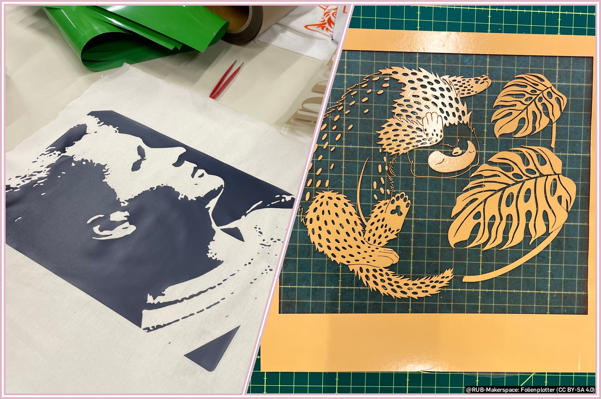

# Studienarbeiten und Praktika

## Studien- und Abschlussarbeiten

Der RUB-Makerspace ist keine wissenschaftliche Einrichtung und hat formal weder Personal mit Lehrbefähigung noch eine Verankerung im regulären Lehrbetrieb der Hochschule. Wir können daher schlichtweg keine eigenen Abschlussarbeiten ausschreiben.  

Sehr gerne sind wir jedoch Praxispartner und ‚Ort des Geschehens‘ bei Abschlussarbeiten und auch an der inhaltlichen Betreuung können wir nach Absprache in gewissem Maße mitwirken. Eine Themenstellung und eine Betreuerin oder einen Betreuer von einem Lehrstuhl müssen Studierende allerdings selbst mitbringen.  

Wir haben Personal mit Lehrerfahrung in verschiedenen Bereichen und sprechen auch gerne mit Wissenschaftler\*innen über Ideen und Kooperationen für Abschlussarbeiten, andere Studien- und Prüfungsleistungen sowie die Lehre allgemein.  
 

## Praktika

Im RUB-Makerspace werden immer wieder Praktika durchgeführt. Die Praktikant\*innen haben dabei ganz verschiedene Hintergründe – vom kurzen Schulpraktikum über längere Orientierungspraktika bis hin zur mehrmonatigen Praktikumsphase im Studium war schon alles mit dabei. Wir sind sehr offen für entsprechende Bewerbungen. Es gelten ggf. die [Regeln für Minderjährige](sicherheit.md#minderjaehrige). 

??? info "Weitere Informationen für Praktikant\*innen"
	

	Wir freuen uns sehr über jede einzelne Person, die bei und mit uns arbeiten möchte! 

	Bedacht werden sollte im Vorfeld trotzdem, dass der Makerspace nicht in allen Aspekten repräsentativ für Arbeitsabläufe aus der Wirtschaft oder der Industrie ist.  
	
	Am Beispiel Metallwerkstatt: Ja, die haben wir. Und sie ist auch mindestens so gut ausgestattet, wie so manche Werkstatt aus der Privatwirtschaft – allerdings wird dort an Einzelstücken entwickelt, es wird gelehrt und unterrichtet und es findet vielleicht auch mal ein paar Tage gar keine Produktion statt. Beispielsweise, wenn das komplette Makerspace-Team für einen umfangreichen Workshop in der Holzwerkstatt, für eine Veranstaltung oder etwas ganz anderes eingespannt ist. Möchte jemand also im Rahmen eines Praktikums den ‘durchschnittlichen‘ Betrieb einer Schlosserei kennenlernen, ist der Makerspace vielleicht nicht die vollständig richtige Umgebung. 

	Von großem Interesse kann der Makerspace allerdings zum Beispiel für Praktikant\*innen sein, die (wie andere Maker\*innen im Makerspace auch) eigene Projektideen haben, die bestimmte Verfahren – durchaus relativ selbstständig – erlernen möchten oder die aus anderen Gründen mit der interdisziplinären Umgebung etwas anfangen können. 
