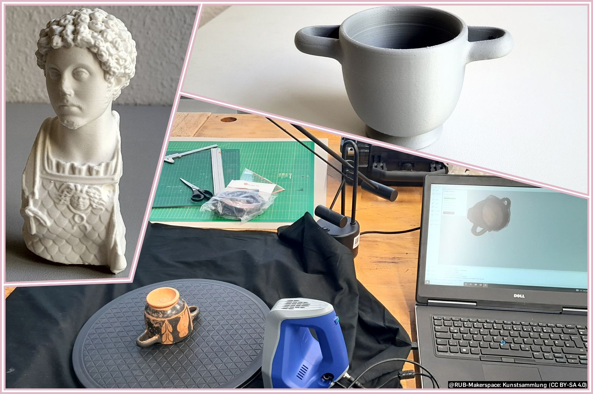
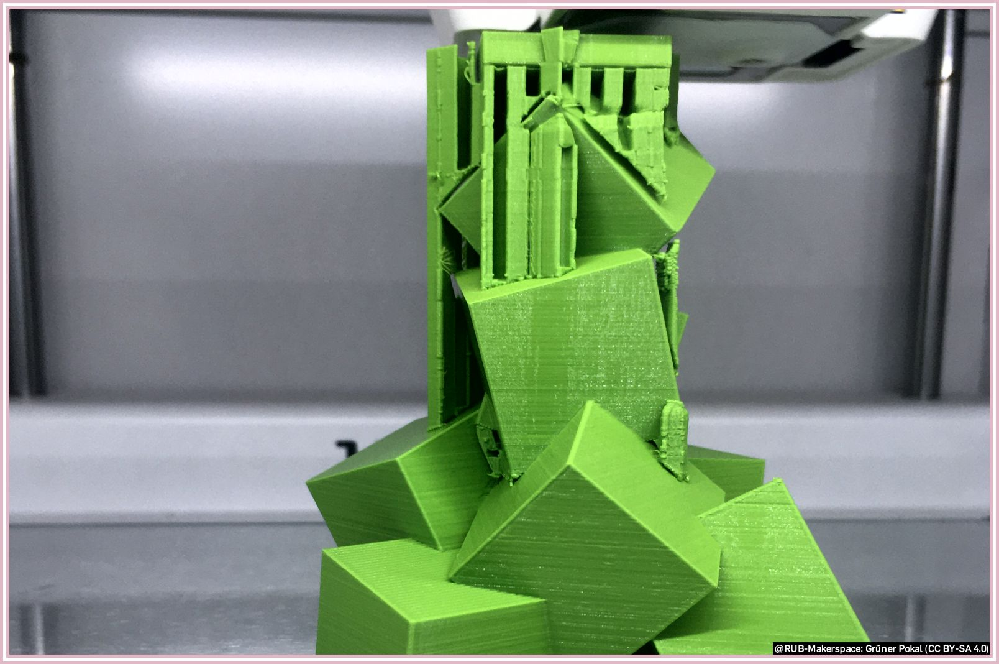
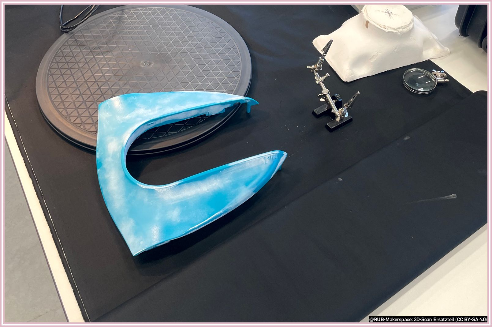
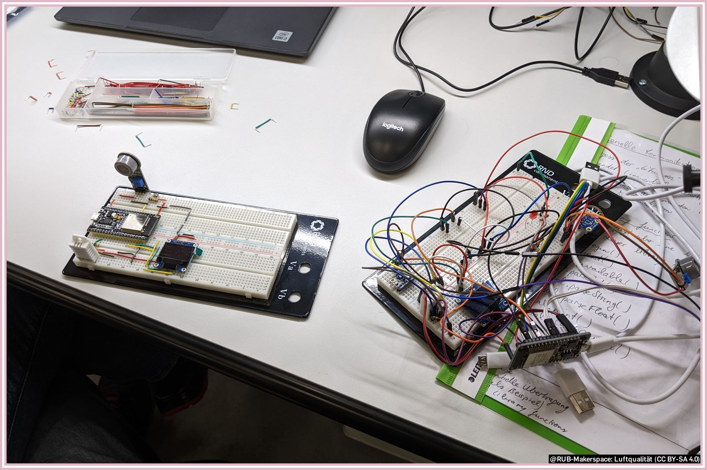
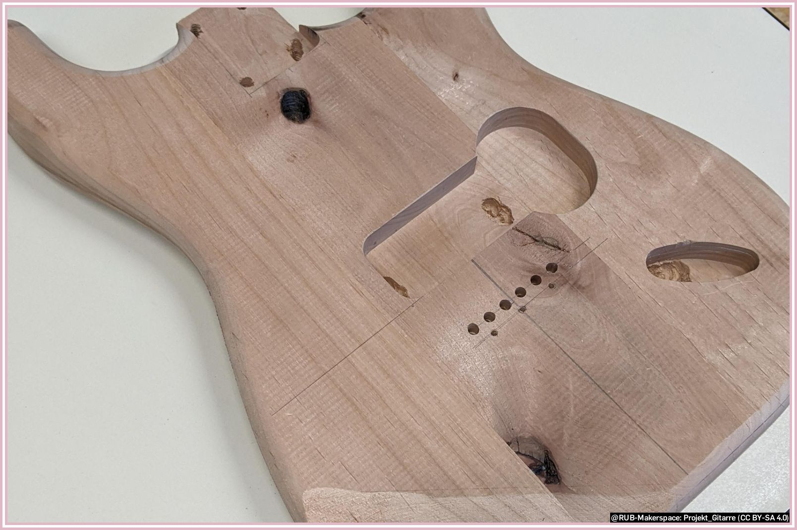

# People and Projects

Here we present the most important: People and their projects from the Makerspace.

!!! info "We are happy about every contribution we are allowed to present here - because [sharing knowledge is the nicest feedback](feedback.en.md#sharing-knowledge-is-the-nicest-feedback)"

### Startup "Pavoa" Invents Tampon Dispenser

Read the article ["Einfach umsetzbar, schnell montiert und kontaktlos"](https://news.rub.de/transfer/2022-10-05-gruendung-einfach-umsetzbar-schnell-montiert-und-kontaktlos) (German).

> "Michael Schwarz invents a tampon dispenser and founds a start-up. Five dispensers will be in use from October 2022 in the pilot project Free Menstrual Products at RUB. [...] Besides his studies, Michael Schwarz works in the Makerspace at RUB. It was there that he also had the opportunity to produce his tampon dispensers in the 3D printers."  
> *Katrin Heyer, translated from the above mentioned article*

### Replicating Ancient Artifacts, Preserving Them and Bringing Them to Life

 
Read the article ["Studentische Projekte in die Kunstsammlungen Antike implementiert"](https://news.rub.de/studium/2022-08-03-archaeologie-studentische-projekte-die-kunstsammlungen-antike-implementiert) (German).
Visit the website of the [Kunstsammlung Antike (Ancient Art Collection)](https://www.ruhr-uni-bochum.de/kunstsammlungenantike/index.html.en)

> "Ceren Simsek, Jessica Noffc and Robin Beuting (from left) have chosen 3D prints of busts from the Antique Art Collection. The prints are robust and can also be experienced haptically by visitors. [...] In cooperation with the Makerspace, some students used the 3D printers there and created copies of the exhibits."  
> *Katrin Heyer, translated from the above mentioned article*

### Goblet 3D Printed

> This project shows a semi-finished trophy that a group of users wanted to make for a pitch event.
They created a CAD model on a computer and then prepared it in a slicer software for 3D printing.
To produce good quality, they set the layer thickness to be very thin. The print took longer for this, but required hardly any post-processing. PLA filament was used as the material, which is standard in the FDM printing process.
If you have any questions about 3D printers and slicers, please contact the team of the [design lab](designlabor.en.md).

### Spare Part 3D Scanning

> In this case, a maker wanted to produce a replacement part for a garden tool.
To do this, he brought the defective part to the RUB Makerspace and digitized it there using the 3D scanners.
To achieve better results, the part was sprayed with a matting spray in advance.
Afterwards, they refined the finished scan on a computer and finalized it as a model.
If you have any questions about 3D scanning, please contact the team of the [design lab](designlabor.en.md).

### Sensors for Air Quality in the Makerspace

> In order to check the air quality, this project was implemented in the digital lab of the RUB Makerspace.
A microcontroller, a sensor to measure the air quality, a display to visualize the data and other peripherals in the form of a breadboard and a few cables and resistors were used.
If you have any questions about working and programming with microcontrollers, please contact the [digital lab](digitallabor.en.md) team.

### Projects with the Foil Plotter

> These examples are from a seminar and from a student intern.
In both cases, the makers used (self-created) images and converted them into vector graphics using the [Inkscape](https://inkscape.org/?switchlang=en) program.
These vector graphics were transferred to textile foil using the cutting plotter and cut out.
Then the patterns were freed from scraps and applied to textiles using the transfer press.
If you have any questions about the cutting plotter and the heat press, please contact the team at [design lab](designlabor.en.md).

### A Two Color Scarf Knitted with Our Kniterate

> This scarf was made by a foundress using the Kniterate knitting machine in our Textile Lab.
For this she took two different colors of yarn and designed patterns herself.
She used the software that comes with the knitting machine.
If you have any questions about the kniterate, please contact the team of the [design lab](designlabor.en.md).

### Laser Engraving with Our Laser Cutter

> In this example, a user engraved a flower pot with the help of laser cutting.
The flower pot was clamped in an associated rotation device for this purpose.
The data was created with [Inkscape](https://inkscape.org/?switchlang=en). The ceramic was not engraved here, but the colored glaze.
If you have any questions about the laser cutter, please contact the team of the [design lab](designlabor.en.md).

### Electric Guitar Body with Shaper Origin

> Building your own electric guitar - that's what this maker thought.
With the help of our smart milling machine, the Shaper Origin, he has made this vision come true.
He found the construction plan for the guitar on the Internet.
Using the program [Inkscape](https://inkscape.org/?switchlang=en), the vector graphic found there was edited and modified for the shaper.
The body was then milled out in two steps, later painted and assembled with the remaining elements.
Questions about the ShaperOrigin are best asked to the team of the [wood workshop](holzwerkstatt.en.md).