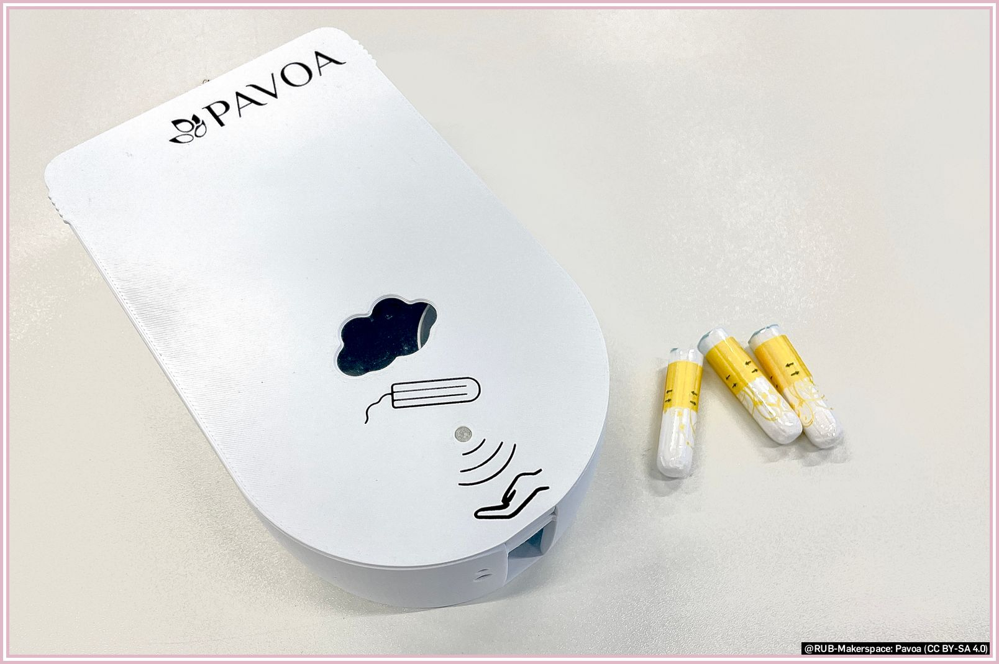
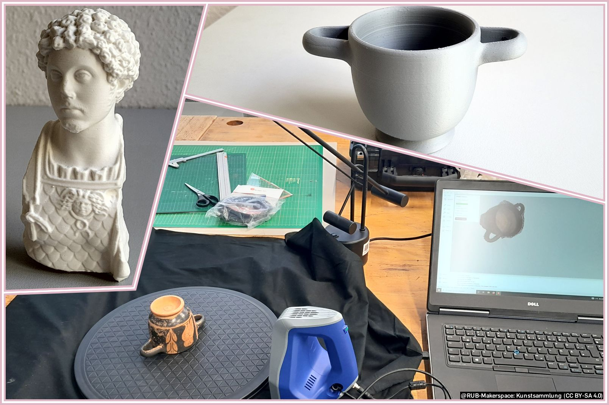
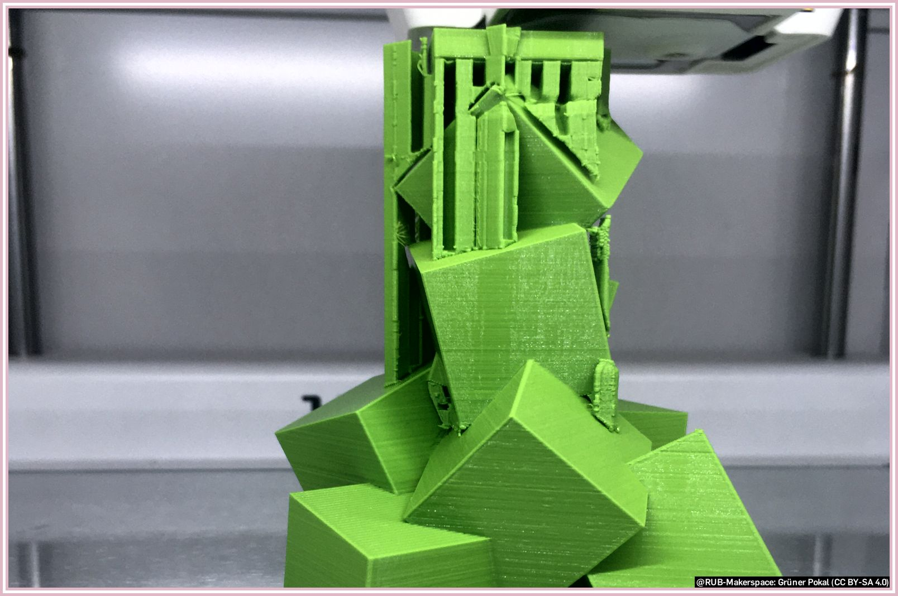
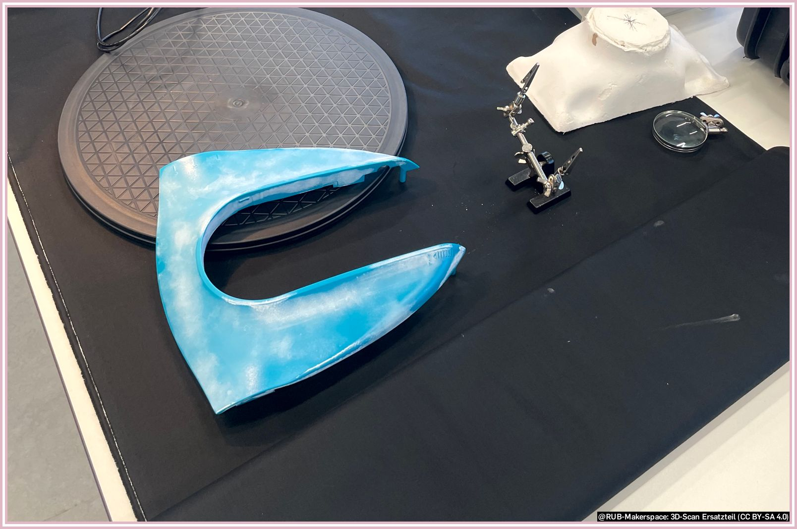
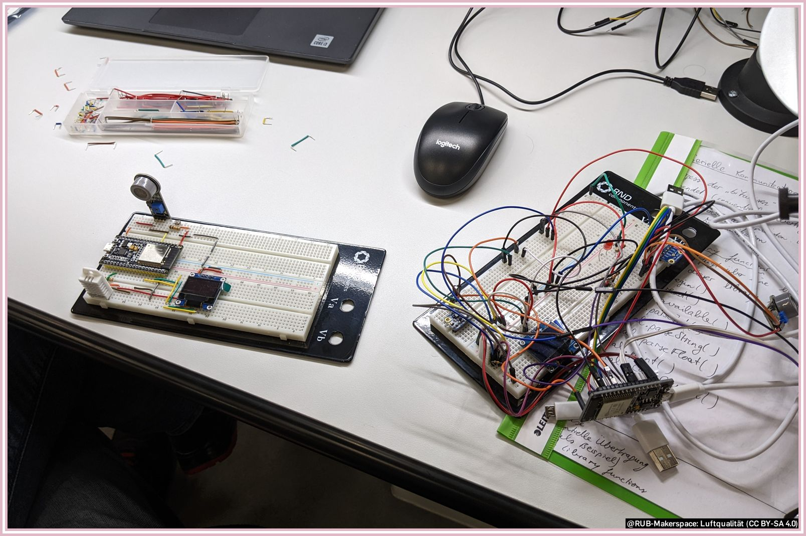
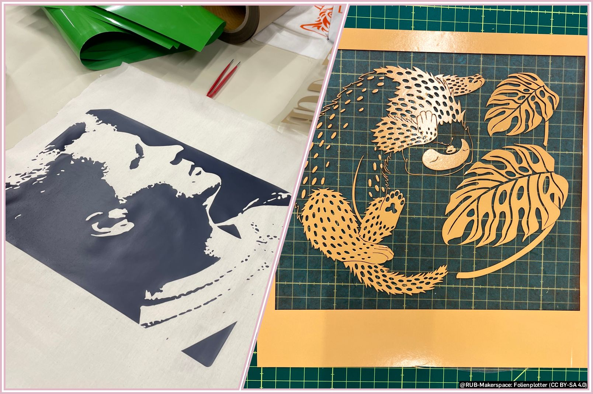
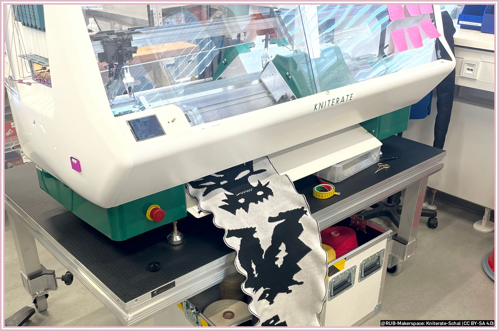
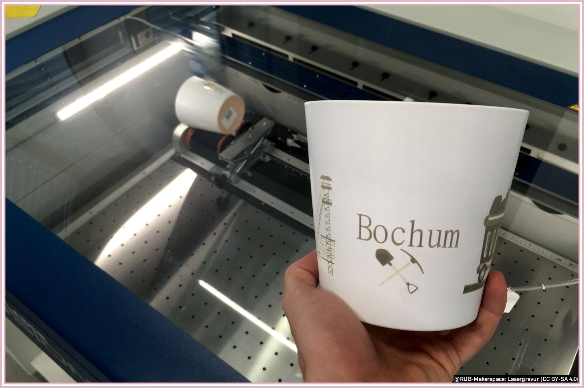
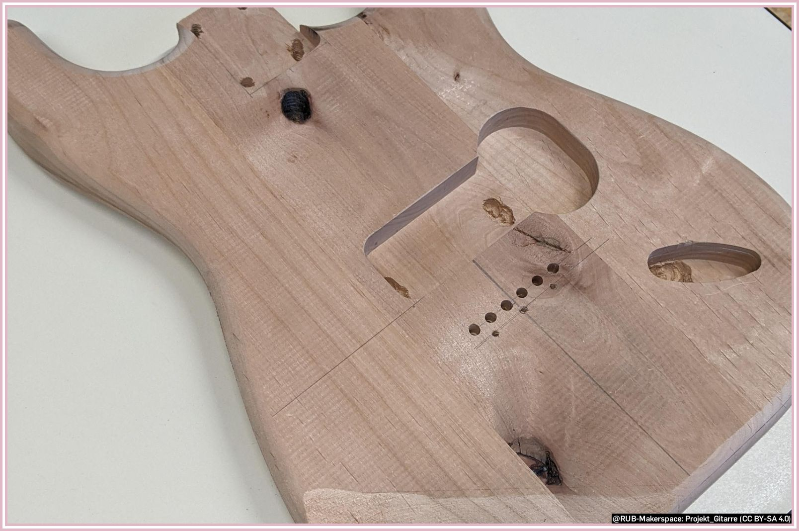

# Menschen und Projekte

Hier stellen wir das Wichtigste vor: Menschen und ihre Projekte aus dem Makerspace.

!!! info "Wir freuen uns über jeden Beitrag, den wir hier vorstellen dürfen – denn [Wissen Teilen ist das schönste Feedback](feedback.md#wissen-teilen-ist-das-schonste-feedback)!"

### Start-up "Pavoa" erfindet Tamponspender

Zum Artikel ["Einfach umsetzbar, schnell montiert und kontaktlos"](https://news.rub.de/transfer/2022-10-05-gruendung-einfach-umsetzbar-schnell-montiert-und-kontaktlos).

> "Michael Schwarz erfindet einen Tamponspender und gründet ein Start-up. Fünf Spender sind ab Oktober 2022 beim Pilotprojekt Kostenlose Menstruationsartikel an der RUB im Einsatz. [...] Neben dem Studium arbeitet Michael Schwarz im Makerspace der RUB. Dort hatte er auch die Möglichkeit seine Tamponspender in den 3D-Druckern herzustellen."  
> *Katrin Heyer, aus dem oben genannten Artikel*

### Antike Kunstgegenstände replizieren, erhalten und erlebbar machen

 
Zum Artikel ["Studentische Projekte in die Kunstsammlungen Antike implementiert"](https://news.rub.de/studium/2022-08-03-archaeologie-studentische-projekte-die-kunstsammlungen-antike-implementiert).
Zur Webseite der [Kunstsammlung Antike](https://www.ruhr-uni-bochum.de/kunstsammlungenantike/index.html.de)

> "Ceren Simsek, Jessica Noffc und Robin Beuting (von links) haben sich für 3D-Drucke von Büsten der Kunstsammlung Antike entschieden. Die Drucke sind unempfindlich und können von Besucherinnen und Besuchern auch haptisch erfahren werden. [...] In Kooperation mit dem Makerspace haben einige Studierende die dortigen 3D-Drucker genutzt und Kopien von den Ausstellungsstücken erstellt."  
> *Katrin Heyer, aus dem oben genannten Artikel*

### Pokal aus dem 3D-Drucker

> Dieses Projekt zeigt einen halbfertigen Pokal, den eine Gruppe Nutzender für ein Pitch-Event herstellen wollten.
Sie haben dazu ein CAD-Modell am Computer erstellt und anschließend in einer sogenannten Slicersoftware für den 3D-Druck vorbereitet.
Um eine gute Qualität zu erzeugen, wurde die Schichtdicke sehr dünn eingestellt. Der Druck dauerte dafür zwar länger, musste aber kaum nachbearbeitet werden. Als Material wurde PLA-Filament genutzt, was im FDM-Druckverfahren standardmäßig verwendet wird.
Fragen zu 3D-Druckern und den Slicern stellst Du am besten an das Team vom [Designlabor](designlabor.md).

### Ersatzteil 3D-Scannen

> Hier wollte ein Maker ein Ersatzteil für ein Gartengerät produzieren.
Dazu hat er das defekte Teil mit in den RUB-Makerspace gebracht und dort mithilfe der 3D-Scanner digitalisiert.
Um bessere Ergebnisse zu erzielen, wurde das Teil vorab mit einem Mattierungsspray eingesprüht.
Der fertige Scan wurde dann am Computer nachbearbeitet und als Modell finalisiert.
Fragen zu den 3D-Scannern stellst Du am besten an das Team vom [Designlabor](designlabor.md).

### Sensoren für die Luftqualität im Makerspace

> Um die Luftqualität in unserem Makerspace zu überprüfen, wurde dieses Projekt im Digitallabor umgesetzt.
Genutzt wurden hier ein Microcontroller, ein Sensor zur Erfassung der Luftqualität, ein Display zur Datenvisualisierung sowie weitere Peripherie in Form eines Breadboards und ein paar Kabeln und Widerständen.
Fragen zum Arbeiten und Programmieren mit Microcontrollern stellst Du am besten an das Team des [Digitallabors](digitallabor.md).

### Projekte mit dem Folienplotter

> Diese Beispiele sind aus einem Seminar und von einer Schülerpraktikantin entstanden.
In beiden Fällen haben die Makerinnen (selbsterstellte) Bilder genutzt und mit dem Programm [Inkscape](https://inkscape.org/de/) in Vektorgrafiken umgewandelt.
Diese Vektorgrafiken wurden mithilfe des Schneideplotters auf Textilfolie übertragen und ausgeschnitten.
Anschließend wurden die Muster von Resten befreit und mithilfe der Transferpresse auf Textilien angebracht.
Fragen zum Schneideplotter und der Transferpresse stellst Du am besten an das Team vom [Designlabor](designlabor.md).

### Ein zweifarbiger Schal gestrickt mit unserer Kniterate

> Diesen Schal hat eine Gründerin mit der Kniterate Strickmaschine in unserem Textillabor hergestellt.
Hierzu hat sie zwei unterschiedliche Garnfarben verwendet und selbst Muster entworfen.
Dazu hat sie die zur Strickmaschine zugehörige Software genutzt.
Fragen zur Kniterate stellst Du am besten an das Team vom [Designlabor](designlabor.md).

### Lasurgravur mit unserem Lasercutter

> Hier hat ein Nutzer einen Blumentopf mithilfe des Lasercutters graviert.
Der Blumentopf wurde dafür in eine zugehörige Rotationsvorrichtung eingespannt.
Die Daten wurden mit [Inkscape](https://inkscape.org/de/) erzeugt. Graviert wurde hier nicht die Keramik sondern die Farbglasur.
Fragen zum Lasercutter stellst Du am besten an das Team vom [Designlabor](designlabor.md).

### E-Gitarrenkorpus mit der Shaper Origin

> Eine eigene E-Gitarre bauen – das hat sich dieser Maker gewünscht.
Mithilfe unserer smarten Oberfräse, der Shaper Origin, hat er sich diese Vision erfüllt.
Den Bauplan für die Gitarre stammt aus dem Internet.
Die dort gefundene Vektorgrafik wurde mithilfe des Programms [Inkscape](https://inkscape.org/de/) bearbeitet und für die Fräse modifiziert.
Anschließend wurde der Körper in zwei Schritten ausgefräst, später lackiert und mit den restlichen Elementen zusammengefügt.
Fragen zur ShaperOrigin Oberfräse stellst Du am besten an das Team der [Holzwerkstatt](holzwerkstatt.md).