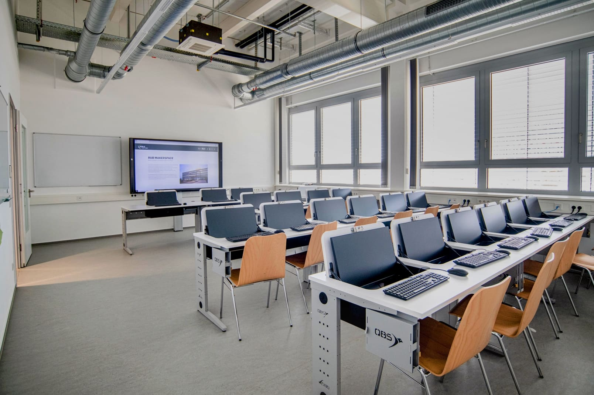
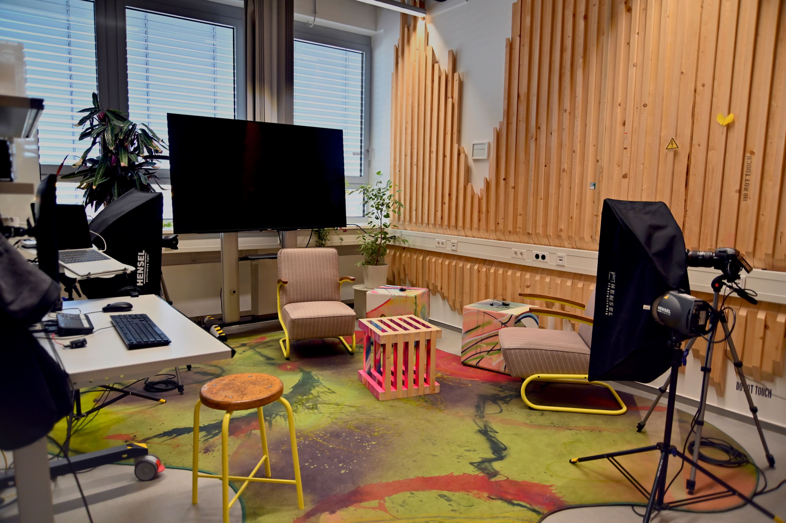

# Project and Seminar Rooms

You need your own room for a few hours to work with your team on your project? Are you still looking for a seminar room with technology for your teaching? The interdepartmental quarterly meeting is coming up and you just want to get out of your own four meeting room walls? We might have something for you! 

!!! info "All rooms can be booked [by arrangement](kontakt.en.md) with us individually."

## Seminar Room

Our seminar room can be adapted to your needs with its movable tables. Here you will find an 86-inch touch TV with which you can connect your end device. The seminar room can also be equipped differently by arrangement - creative furniture, other work equipment, alternative seating (for example chairs with folding tables) and much more is possible.   

## Computer Room {: #computerraum }

Our Computer Room has 20 PC workstations for participants and one for presenters. A large touch TV with 86 inch diagonal is available for presentations. The computers can be folded in so that the Computer Room can also be used as a classic seminar room. One workstation is wheelchair accessible.

**Our Devices:** 

The computers are [thin clients](https://en.wikipedia.org/wiki/Thin_client), i.e. the actual computer is located in the university's computer center and is administered centrally by [IT.Services](https://www.it-services.ruhr-uni-bochum.de/services/sl/pc-pools.html.de). Various software relevant for "making" is pre-installed. The use of the workstations requires a RUB login ID or an [event account](https://www.it-services.ruhr-uni-bochum.de/services/gz/veranstaltungsaccounts.html.de).

You can find an overview of all computers and software in the Makerspace [here](digitallabor.en.md#computer-und-it).

## Practical Seminar Room {: #praxisseminarraum }

Our practical seminar room in the basement is intended for seminars and groups that need a seminar room with workshop character for their (teaching) event. The room can be flexibly equipped - for example with chairs folding tables, classic tables or with our mobile workbenches as well as tools and machines and media technology as required.    

Compressed air, high voltage current and a wash basin with mud trap as well as roll-up doors to the outside and roll-up doors to the adjacent workshops (Digital Lab and Metal Workshop with another roll-up door to the Wood Workshop) are part of the basic equipment. Depending on the configuration, the room can accommodate 6-20 people.

## Project Rooms

We have two project rooms on each floor for about 3-6 people. The rooms are furnished very differently and are intended to serve you and your team as a project, retreat, meeting or simply as a flexibly usable space.  

