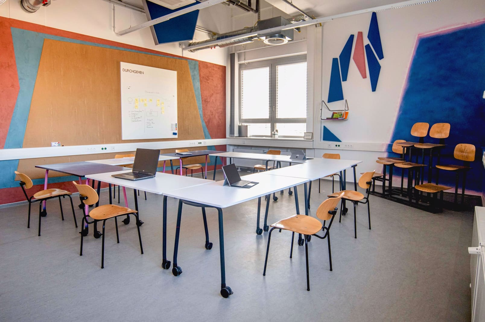
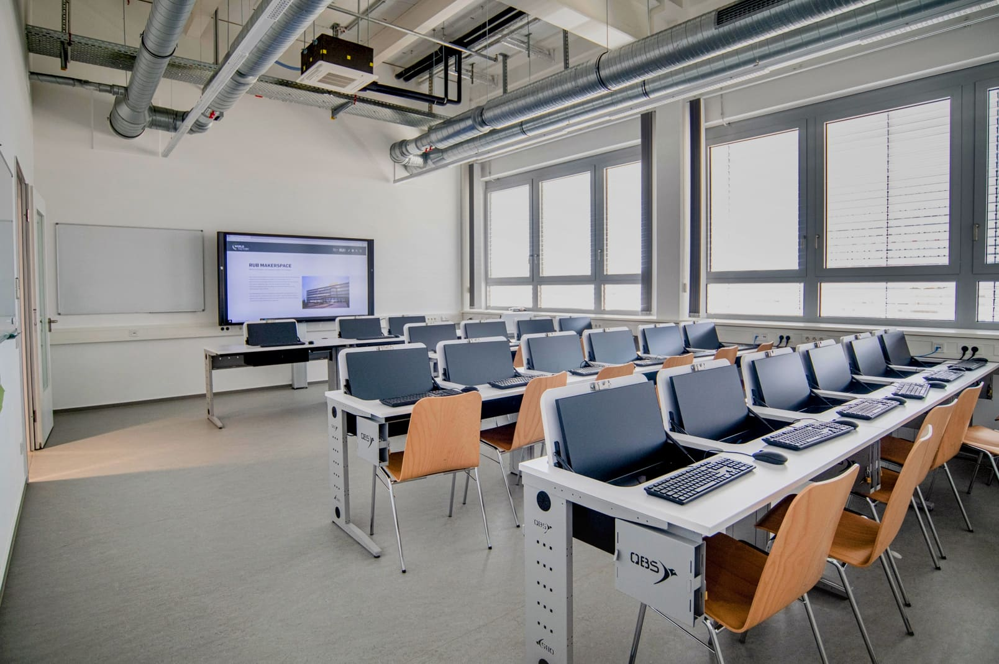
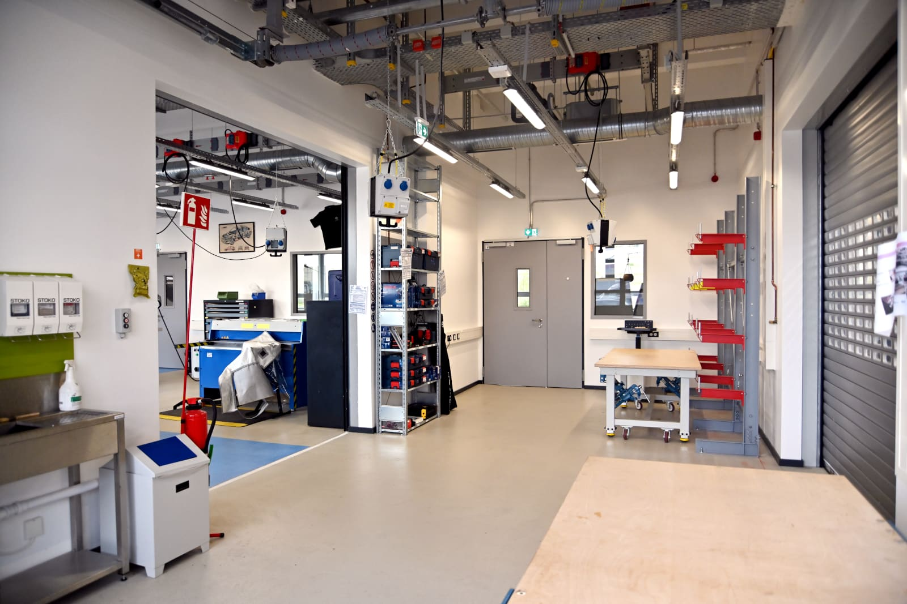
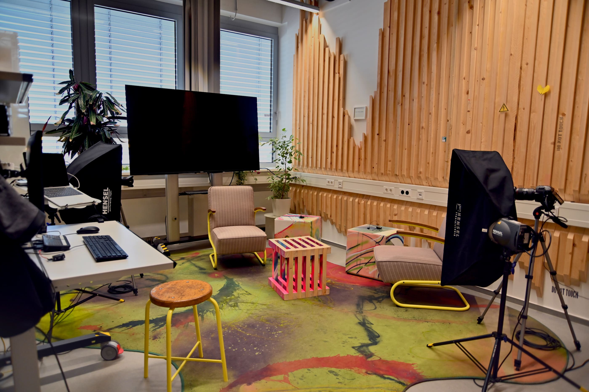

# Projekt- und Seminarräume

Du brauchst einen eigenen Raum für ein paar Stunden, um mit Deinem Team an Eurem Projekt zu arbeiten? Du suchst für Deine Lehre noch nach einem Seminarraum mit Technik? Es steht das abteilungsübergreifende Quartalstreffen an und Du willst einfach mal aus den eigenen vier Besprechungsraumwänden raus? Wir haben da vielleicht was! 

!!! info "Alle Räume können [nach Absprache](kontakt.md) mit uns individuell gebucht werden."

## Seminarraum {: #seminar }

Unser Seminarraum kann mit seinen beweglichen Tischen ganz nach Deinen Bedürfnissen angepasst werden. Hier steht ein 86 Zoll großer Touch-Fernseher, mit dem Du Dein Endgerät verbinden kannst. Der Seminarraum kann nach Absprache auch anders bestückt werden – Kreativmöbel, andere Arbeitsmittel, alternative Bestuhlung (zum Beispiel Stühle mit Klapptischen) und vieles mehr ist möglich.  

## Computerraum {: #computerraum }

Unser Computerraum verfügt über 20 PC-Arbeitsplätze für Teilnehmende und einen für Vortragende. Ein großer Touch-Fernseher mit 86 Zoll Diagonale steht für Präsentationen zur Verfügung. Die Computer können eingeklappt werden, sodass der Computerraum auch als klassicher Seminarraum genutzt werden kann. Ein Arbeitsplatz ist rollstuhlgerecht ausgeführt.

**Unsere Geräte:** 

Die Computer sind [Thin Clients](https://de.wikipedia.org/wiki/Thin_Client), das heißt der eigentliche Computer steht im Rechenzentrum der Uni und wird zentral durch [IT.Services administriert](https://www.it-services.ruhr-uni-bochum.de/services/sl/pc-pools.html.de). Es ist verschiedene, fürs "Making" relevante, Software vorinstalliert. Die Nutzung der Arbeitsplätze erfordert eine RUB-Login-ID oder einen [Veranstaltungsaccount](https://www.it-services.ruhr-uni-bochum.de/services/gz/veranstaltungsaccounts.html.de).
  
[Hier](digitallabor.md#it) gibt es eine Übersicht über alle Computer und Software im Makerspace.

## Praxisseminarraum {: #praxisseminarraum }

Unser Praxisseminarraum im Untergeschoss ist für Seminare und Gruppen gedacht, die einen Seminarraum mit Werkstattcharakter für ihre (Lehr-)Veranstaltung benötigen. Im Alltag wird der Raum auch als gemeinsamer Bank- und Multifunktionsarbeitsplatz aller Werkstätten und Labore genutzt.

Der Raum kann flexibel ausgestattet werden – zum Beispiel mit Stühlen, Klapptischen, klassischen Tischen oder mit unseren mobilen Werkbänken, Werkzeugen und Maschinen sowie Medientechnik nach Bedarf. Druckluft, Starkstrom und ein Waschbecken mit Schlammfang sowie Rolltore ins Freie und Rolltore zu den angrenzenden Werkstätten (Digitallabor und Metallbauwerkstatt mit weiterem Rolltor zur Holzwerkstatt) gehören zur Grundausstattung. Je nach Konfiguration bietet der Raum 5-20 Personen Platz.

## Projekträume

Wir haben auf beiden Stockwerken je zwei Projekträume für circa 3-6 Personen. Die Räume sind ganz unterschiedlich eingerichtet und sollen Dir und Deinem Team als Projekt-, Rückzugs-, Besprechungs- oder einfach nur als flexibel nutzbarer Raum dienen.  

