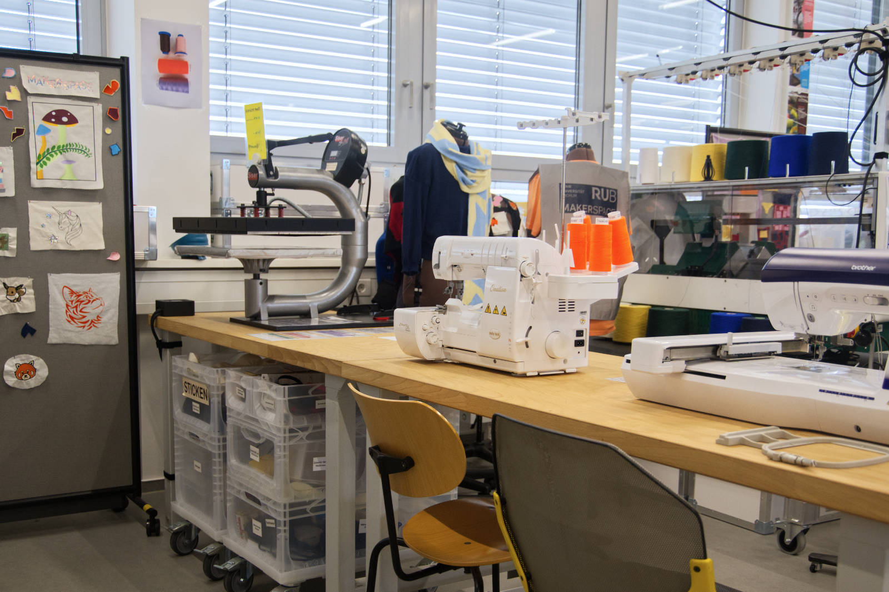
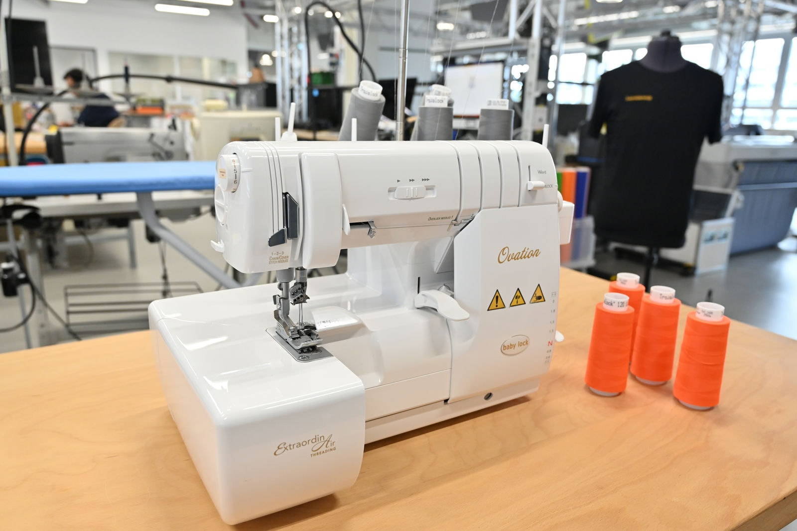
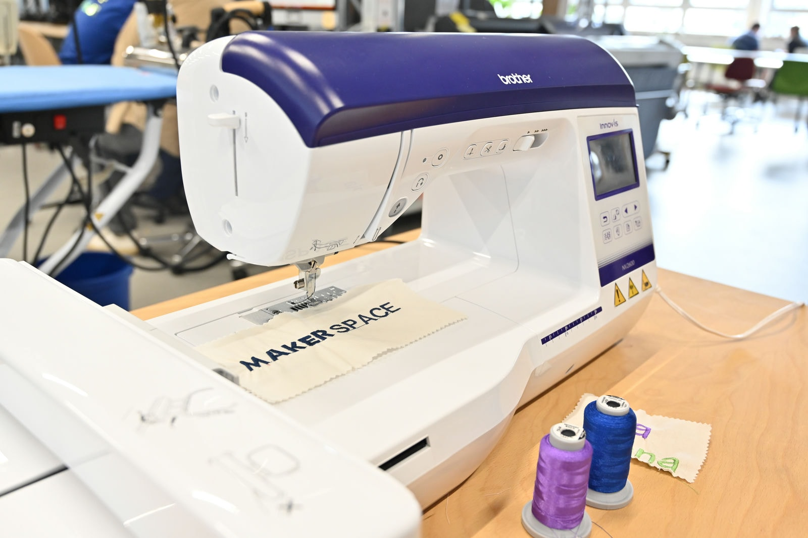
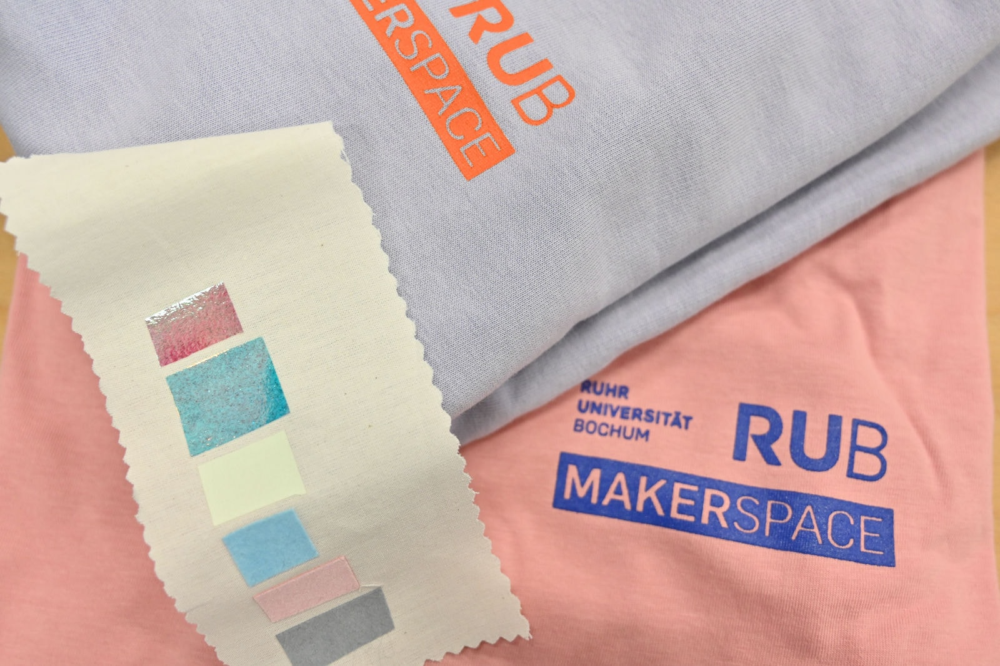
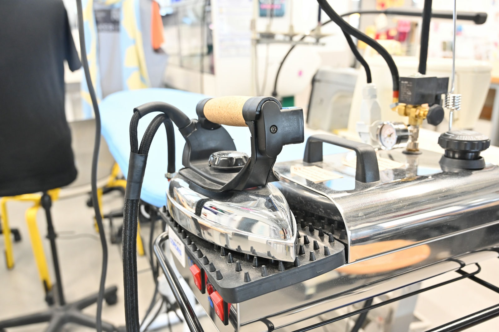
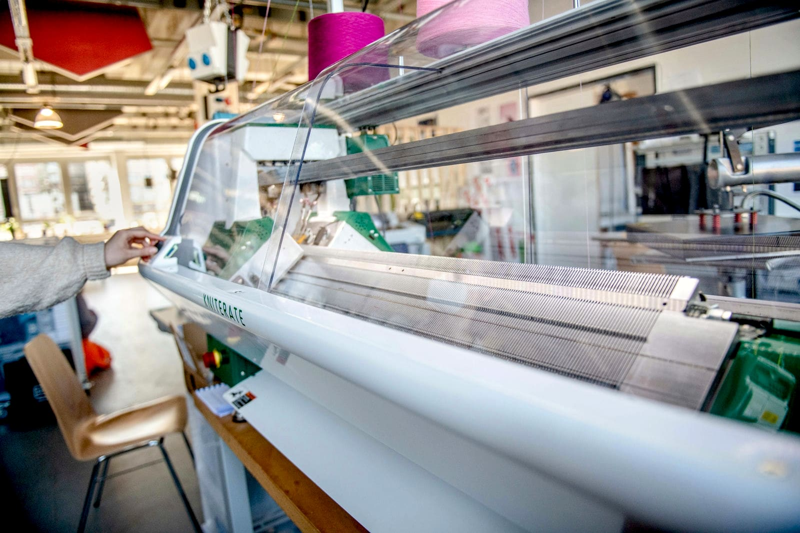

# Textile Lab

!!! info "Availability of Machines and Devices" 

	From time to time, certain machines and equipment may not be available for use due to renovations, expansions, maintenance, repairs or other similar reasons. This may be because they are out of order or require initial commissioning. If you require the use of specific equipment for your project, we ask that you contact the relevant contacts by email or telephone in advance to ensure availability.

Our Textile Lab offers you both manual and digital equipment to create or process different types of textiles. For example, you can have patterns embroidered automatically, cut foils and press them onto fabrics, or even have our Kniterate knit for you. The sewing machine and coverlock can also be used to perform classic sewing work for various applications. 

??? question "Who is the contact for the Textile Lab?"
	
	--8<--
	eb.en.md
	--8<--

!!! info "[To the work folder 'Textile Lab' with further documents](https://ruhr-uni-bochum.sciebo.de/s/VuFDh7eChe6z1v7?path=%2FTextillabor)"

    In this folder you will find further documents on all areas of the Textile Lab, such as operating instructions, templates and samples, tutorials and other things to make your work easier. 
    As always: Together we are stronger - we are happy about every [contribution to the collection of knowledge and experience](feedback.en.md).

**Our devices (*Links lead to the manufacturer's website*):** 

## Babylock Ovation

[Babylock Ovation:](https://www.babylock.de/naehmaschinen/ovation ) This coverlock machine can sew overlock stitches, cover stitches and warp stitches and is used especially for professional serging.

## Brother Innov

[Brother Innov-is NV2600:](https://support.brother.com/g/b/producttop.aspx?c=de&lang=de&prod=hf_inov2600euk) This sewing and embroidery machine can embroider designs up to 16cm x 26cm. Files in PES, PHC or DST format are loaded onto the machine using a USB stick and created using [PE-Design 11](https://sewingcraft.brother.eu/de-de/produkte/maschinen/pe-design-software/pe-design-11) on a work computer in the design lab or the [Ink/Stitch extension](https://inkstitch.org/) for [Inkscape](https://inkscape.org/).

## Summa S One

[Summa S One D60:](https://www.summa.com/de/losungen/s-one-folienschneideplotter/) This vinyl cutter can cut material with a width of 79-705mm and a thickness of 0.05-0.25mm. It is addressed with [Summa Go Sign](https://www.summa.com/de/losungen/gosign-software/), which can process files in PDF, DXF, OXF, SGP, PLT, HPGL and DMPL formats. Such a PDF file is based on a vector graphic file where the paths indicate the cutting edges. 

## Siser TS

[Siser TS One Swing and Pull:](https://www.siser.com/de/transferpressen/manuelle-transferpresse-ts-one/) This heat press can press transfer textile foils onto heat-resistant textiles/materials. The heat press has a pressing surface of up to 30cm x 15cm and reaches temperatures of up to 230°C. Motifs can be cut out with the cutting plotter.

## Cordes Dampferzeuger

[Cordes Dampferzeuger Typ 51532 mit Bügeleisen:](https://www.cordes-buegeltechnik.de/shop/product/73200-easy-work-dampferzeuger-mit-profi-bugeleisen-237?category=31) is a steam ironing centre that can be used for ironing or blocking finished knits, for example. It reaches temperatures of up to 215°C.

## Kniterate

[Kniterate:](https://www.kniterate.com/product/kniterate-the-digital-knitting-machine/) This digital knitting machine has two knitting beds with 252 needles each, so you can knit things up to 504 stitches wide. [Kniterate's own free browser-based software](https://support.kniterate.com/hc/en-us/categories/360000653077-Software) can be used to create knitting patterns in up to 5 colours. 
