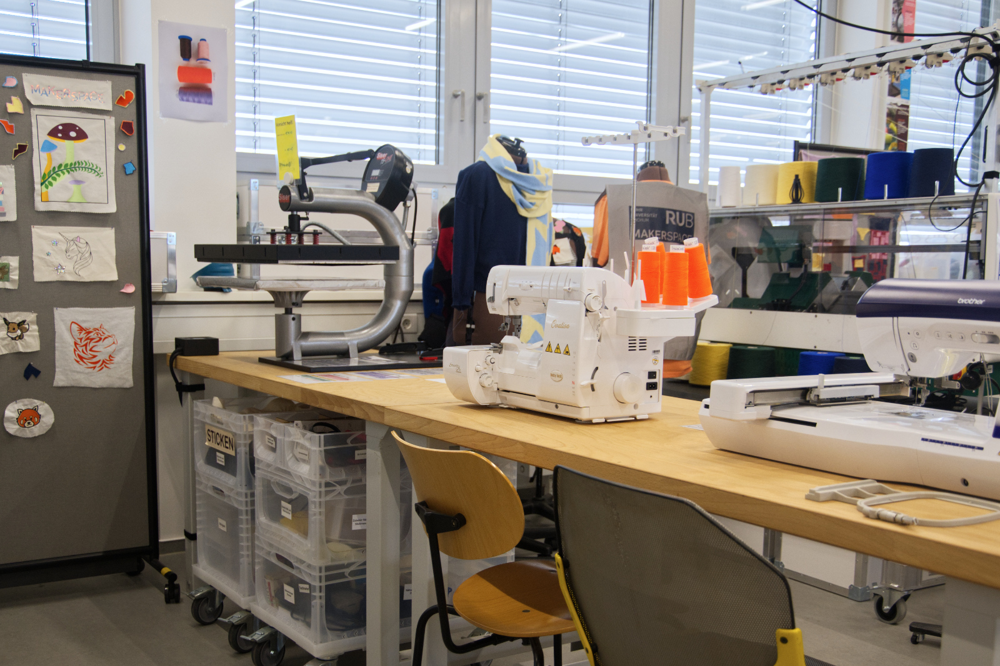
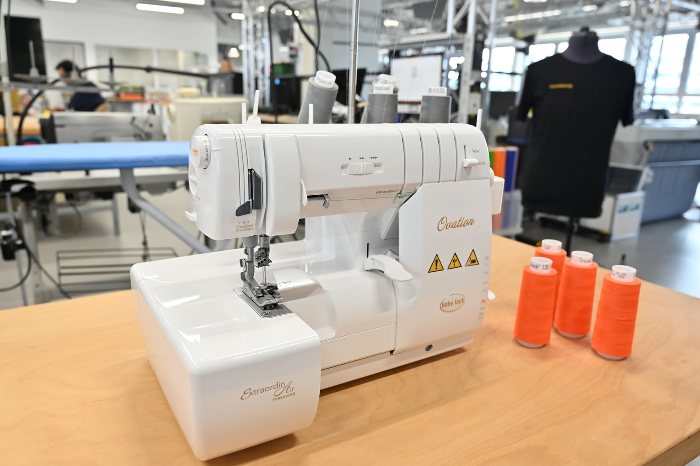
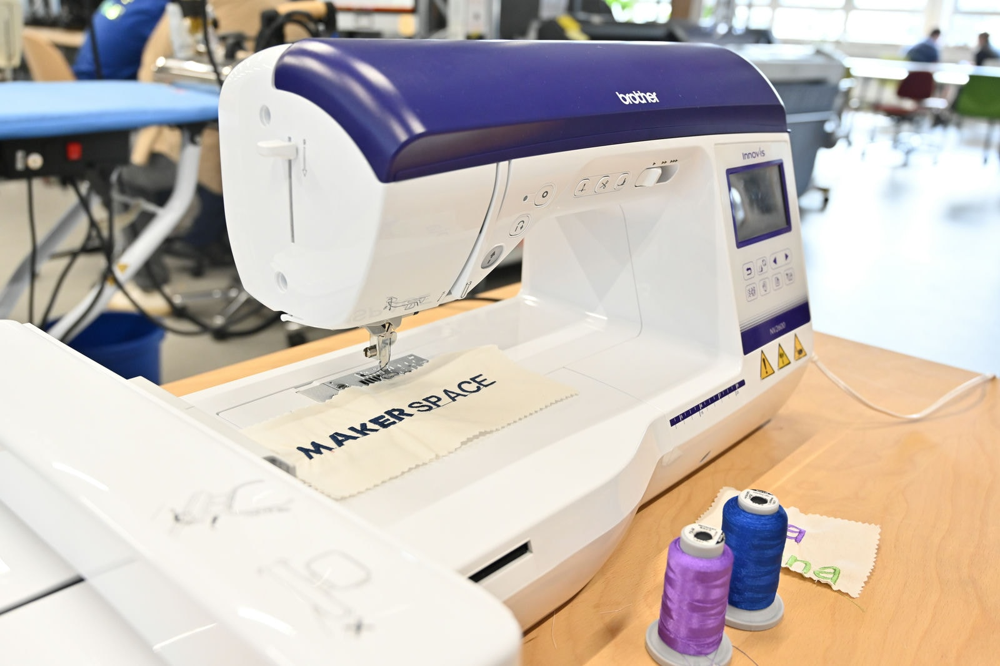
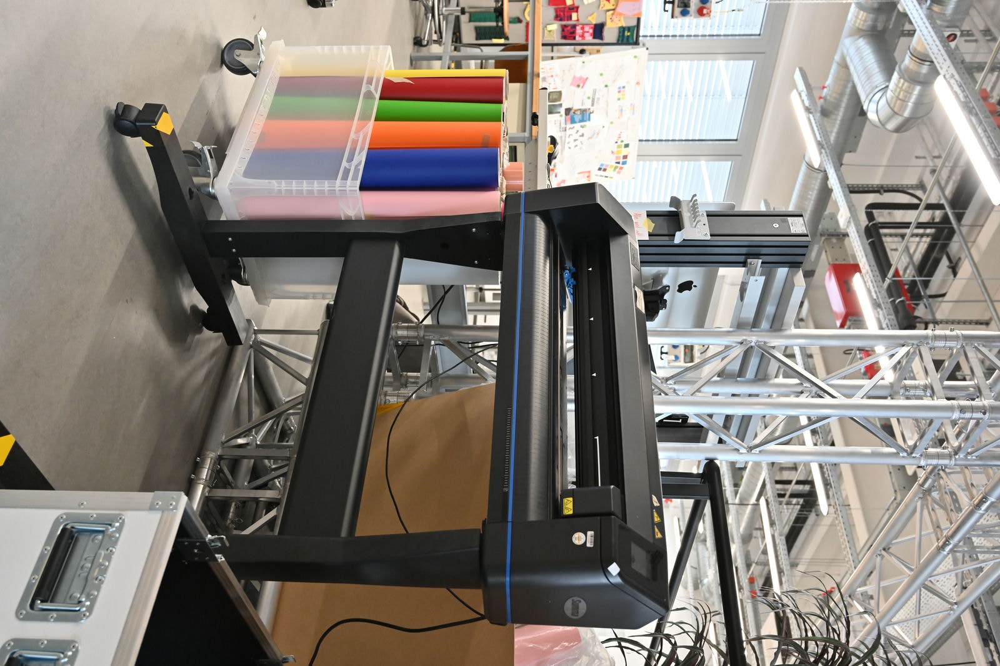
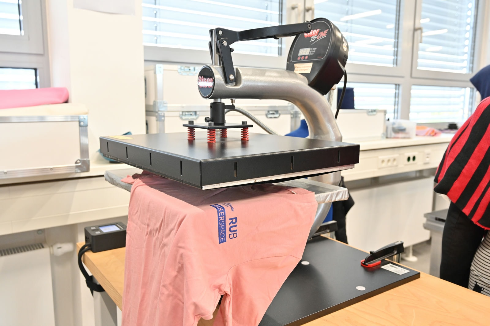
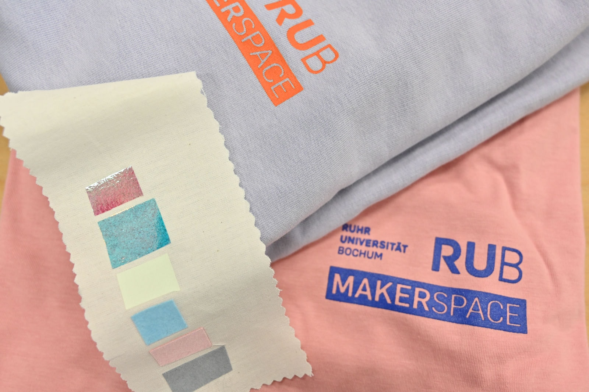
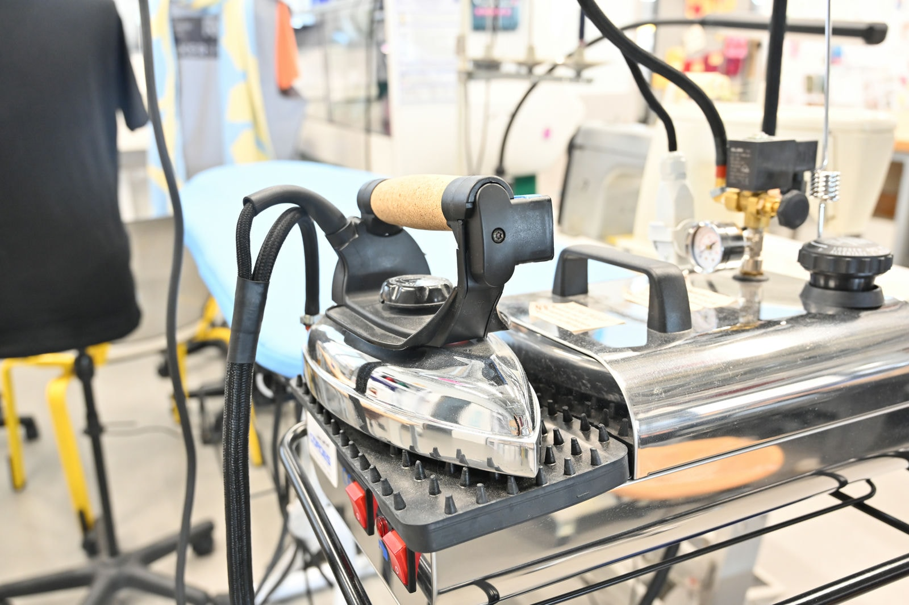
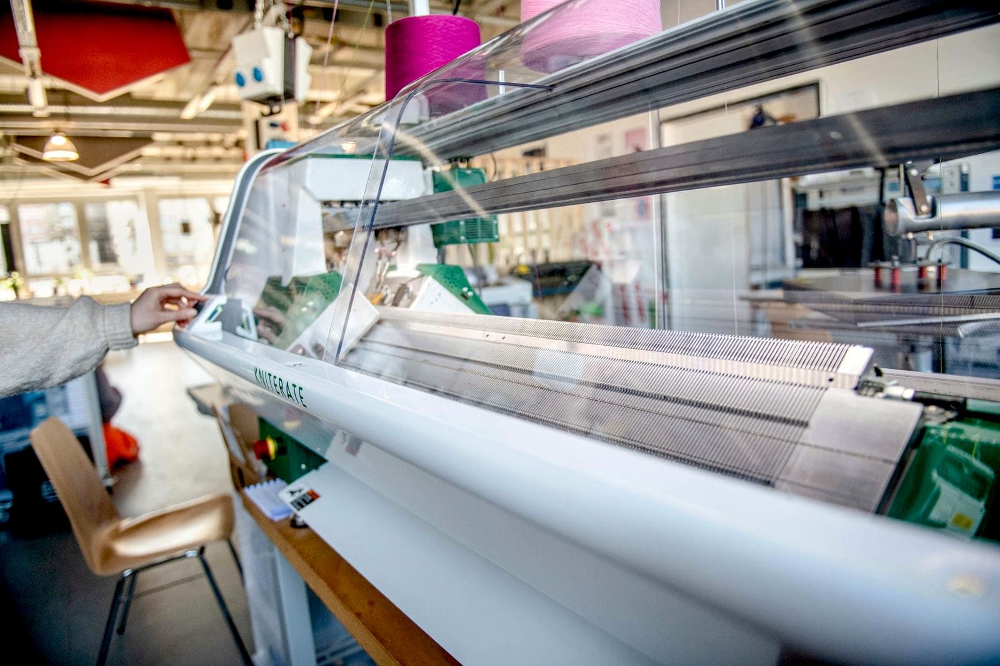

# Textillabor

Unser Textillabor bietet Dir sowohl manuelle, als auch digitale Geräte, um verschiedene Arten von Textilien zu erstellen oder zu verarbeiten. Zum Beispiel kannst Du Muster automatisiert sticken lassen, Folien zuschneiden und auf Stoffe pressen oder sogar unsere Kniterate für Dich stricken lassen. Mit der Nähmaschine und der Coverlock lassen sich aber auch klassische Näharbeiten für unterschiedliche Anwendungen durchführen. 

??? question "Wer ist die Ansprechperson für das Textillabor?"
	
	--8<--
	eb.md
	--8<--

!!! info "[Zum Arbeitsordner 'Textillabor' mit weiteren Unterlagen](https://ruhr-uni-bochum.sciebo.de/s/VuFDh7eChe6z1v7?path=%2FTextillabor)"

    In diesem Ordner findest Du weitere Unterlagen zu allen Bereichen des Textillabors wie zum Beispiel Bedienungsanleitungen, Betriebsanweisungen, Vorlagen und Muster, Tutorials und andere Dinge, die Dir die Arbeit erleichtern sollen. 
    Wie immer gilt: Gemeinsam sind wir stärker – wir freuen uns über jeden [Beitrag zur Wissens- und Erfahrungssammlung](feedback.md).

**Unsere Geräte (*Links führen zur Internetseite der Hersteller bzw. der dazugehörigen Software*):** 

## Babylock Ovation

[Babylock Ovation:](https://www.babylock.de/naehmaschinen/ovation ) Diese Coverlock-Maschine kann Overlock-Stiche, Coverstiche und Kettstiche nähen und wird insbesondere zum professionellen Versäubern benutzt. 

## Brother Innov Stickmaschine

[Brother Innov-is NV2600:](https://support.brother.com/g/b/producttop.aspx?c=de&lang=de&prod=hf_inov2600euk) Diese Näh- und Stickmaschine kann Stickmuster bis zu einer Größe von 16cm x 26cm sticken. Dateien im PES, PHC oder DST Format werden mit einem USB-Stick auf die Maschine geladen und mithilfe von [PE-Design 11](https://sewingcraft.brother.eu/de-de/produkte/maschinen/pe-design-software/pe-design-11) auf einem Arbeitsrechner im Designlabor oder der [Ink/Stitch-Erweiterung](https://inkstitch.org/) für [Inkscape](https://inkscape.org/) erstellt.  

## Summa S One Schneidplotter

[Summa S One D60:](https://www.summa.com/de/losungen/s-one-folienschneideplotter/) Dieser Folienschneideplotter kann Material mit einer Breite von 79-705mm und einer Dicke von 0.05-0.25mm schneiden. Er wird mit [Summa Go Sign](https://www.summa.com/de/losungen/gosign-software/) angesprochen, das Dateien im PDF, DXF, OXF, SGP, PLT, HPGL und DMPL-Format verarbeiten kann. Solch einer PDF-Datei liegt eine Vektorgrafikdatei zugrunde, wo die Pfade die Schnittkanten angeben. 

## Siser TS Transferpresse

[Siser TS One Swing and Pull:](https://www.siser.com/de/transferpressen/manuelle-transferpresse-ts-one/) Diese Transferpresse kann Transfertextilfolien auf hitzebeständige Textilien/Materialien pressen. Die Transferpresse hat eine Andruckfläche von bis zu 30cm x 15cm und erreicht Temperaturen von bis zu 230°C. Motive können mit dem Schneidplotter ausgeschnitten werden.

## Cordes Dampferzeuger

[Cordes Dampferzeuger Typ 51532 mit Bügeleisen:](https://www.cordes-buegeltechnik.de/shop/product/73200-easy-work-dampferzeuger-mit-profi-bugeleisen-237?category=31) ist ein Dampfbügelcenter zum Beispiel fürs Bügeln oder Blockieren von fertigen Strickstücken. Es erreicht Temperaturen von bis zu 215°C.

## Kniterate digitale Strickmaschine

[Kniterate:](https://www.kniterate.com/product/kniterate-the-digital-knitting-machine/) Diese digitale Strickmaschine hat zwei Strickbetten mit je 252 Nadeln, sodass bis zu 504 Maschen breite Sachen gestrickt werden können. Mit der [Kniterate-eigenen, kostenlosen, browserbasierten Software](https://support.kniterate.com/hc/en-us/categories/360000653077-Software) können Strickmuster in bis zu 5 Farben erstellt werden.