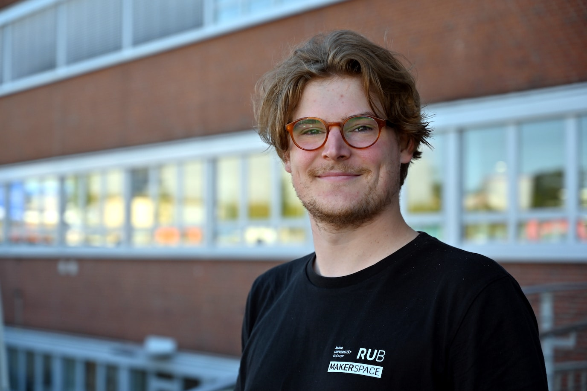

#### Tim Höink {: #th }

=== "Über mich"

	>"Hey, ich bin Tim und im Makerspace für das Medienlabor zuständig. Wenn Du also mit unserer Audiotechnik, unserem Kameraequipment oder unserer Veranstaltungstechnik arbeiten möchtest, dann bin ich Dein Ansprechpartner. Da ich auch in vielen weiteren Bereichen des Makerspace aktiv bin, kannst Du mich auch gerne zu anderen Themen rund um Dein Projekt ansprechen. Neben konkreten technischen Fragen zur Umsetzung Deiner Ideen bin ich auch gern für Dich da, wenn es um Fragen rund um die Methoden des Design Thinking geht."

=== "Kontakt"
	
	- [Kontaktiere uns als Team](kontakt.md)
	- [Persönliche Kontaktdaten Tim Höink im Verzeichnis der RUB](https://einrichtungen.ruhr-uni-bochum.de/de/tim-hoeink)

=== "Hintergrund" 

	- Ausbildung zum technischen Zeichner mit Fachrichtung Versorgungstechnik
	- B.Eng. in Maschinenbau (FH Dortmund), derzeit im M.Sc. Maschinenbau (RUB)
	- Gründungsmitglied Hartkern e.V. - Organisation von Hardcore- und Punk-Konzerten