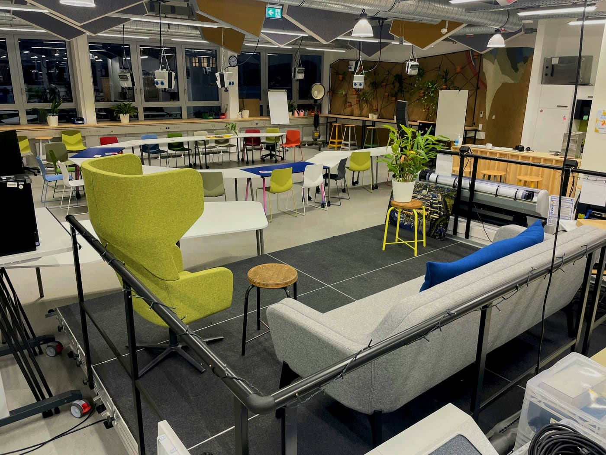

# Events

  

The Makerspace offers a lot of potential outside of its workshops to connect people and to be a place for networking and exchange. Therefore, it is possible to book or rent the Makerspace as an interesting and innovative venue.
Our offer ranges from booking a single project room to a larger event including a stage. We would be happy to show you the possibilities on site; you can already find a small insight into our event technology [here](medienlabor.en.md#live).

??? question "Who is the contact for events?"
    
    --8<--
    gki.en.md
    --8<--

## What Does the Makerspace Offer for events?

- In our [**Co-Working Area** on the first floor](coworking.en.md), events with up to about 100 people can be hosted, depending on seating; in combination with the [basement](coworking.en.md#montagezone) and the [courtyard](coworking.en.md#aussenbereich) even more.
- Stage setups for speakers, presentations, panel discussions, pitches, etc. are possible at various locations in the Makerspace.
- Various large monitors, beamers, wireless microphones, mixers, speakers, etc. are available on site.
- The various [project and seminar rooms](projektraeume.en.md) as well as our [tea kitchens](coworking.en.md#teekuechen) can be shared for events. 
- Our [Kitchen Lab](kuechenlabor.en.md) can accommodate catering for some time before serving.
- Events can also be held in our large [courtyard](coworking.en.md#aussenbereich) with seating block steps.
- Smaller events (up to about 20 people) can be flexibly implemented in different areas in the Makerspace.
- In consultation with the RUB Academy, it is also possible to include the historic foyer of the former Opel administration building for larger events.
- Under certain circumstances, it is also possible to rent our workshops and become active there. 

In the future, we would also like to offer workshops, training or coaching for small groups. If you are already interested in such a format as part of an event with us, please let us know. We will then try to make it possible!

!!! info "A creative environment"

    The RUB Makerspace holds its very own charm and that makes it particularly suitable for events where an unusual, innovative and inspiring environment is desired.  
      
    As a rule, we do not rent out workshop spaces, but these form the backdrop for events. Thus, a creative chaos definitely enriches a rather formal event, arouses interest and promotes the exchange among guests.

!!! info "[To the 'Events' work folder](https://ruhr-uni-bochum.sciebo.de/s/VuFDh7eChe6z1v7?path=%2FVeranstaltungen)"

    In this folder you will find further documents around the topic 'Events in the Makerspace'.
    As always: Together we are stronger - we are happy about every [contribution to the collection of knowledge and experience.](feedback.en.md)

We are happy to offer additional guided tours in the context of a rental and explain pictorially and understandably this very special place and what happens here. 

## Request for an Event at the Makerspace {: #anmeldung-veranstaltung }

<form method="post" action="https://feedback.ruhr-uni-bochum.de/formmailer.php" name="Kontaktformular" enctype="multipart/form-data" class="form">
    <input type="hidden" name="subject"       value="Veranstaltungs-Anfrage von der Makerspace-Homepage" />     
    <input type="hidden" name="recipients"    value="makerspace@ruhr-uni-bochum.de"/>
    <!-- 
    <input type="hidden" name="mail_options" value="CharSet=UTF-8, 
                                                    PlainTemplate=template.txt, 
                                                    TemplateMissing='', 
                                                    Exclude=realname;honigtopf;schicken;FromAddr"/> 
    -->
    <input type="hidden" name="mail_options" value="charset=UTF-8,Exclude=realname;honigtopf;schicken;FromAddr"/>
    <input type="hidden" name="good_url"      value="https://makerspace.ruhr-uni-bochum.de/danke/"  />
    
    <!-- required am Ende der Felddefinition bedeutet: Eingabe ist erforderlich> -->
    

        <label for="nachname"><strong>Name:</strong></label>
        <input name="nachname" type="text" size="40" maxlength="30" required/>
    
                          
    
    

        <label for="vorname"><strong>First Name:</strong></label>
        <input name="vorname" type="text" size="40" maxlength="30" required/>
    
                          

    
 
        <label for="email"><strong>E-Mail:</strong></label>
        <input name="email" type="email" size="40" maxlength="60" required/>
    
          

    

        <label for="tel"><strong>Phone:</strong></label>
        <input name="tel" type="tel" size="40" maxlength="40" placeholder="Optional" />
    
  

    

    <label for="wunschdatum"><strong>Select preferred date</strong></label>
    <input type="date" id="wunschdatum" name="wunschdatum" required>
    

    

        <label for="nachricht" id="nachricht-text"><strong>What do you plan to do?</strong></label>
        <textarea name="nachricht" placeholder="Please describe briefly what your event is about, when it should take place and how we can support you. (Limit: 2000 characters)" rows="6" cols="10" style="width: 100%;" required></textarea>
    
  

    

        <label for="honigtopf"><strong>Please do not fill this field:</strong></label>
        <input name="honigtopf" type="text" maxlength="50" value="" />
    
  

	

		<label for="data-privacy" style="font-size: var(--form-note-font-size);">
			

				<input type="checkbox" id="data-privacy" name="data-privacy" required>
			

			

				I agree to the collection, processing and storage of the information I have provided here in accordance with your
				<a href="/datenschutz/index.html" target="_blank" style="color: var(--link-color);">Datenschutzvereinbarung</a>. I can revoke my consent at any time by sending you an informal message.
			

		</label>
	

    

        <input type="submit" class="md-button" value="Submit Request" name="schicken" /> 
    
                          
</form>