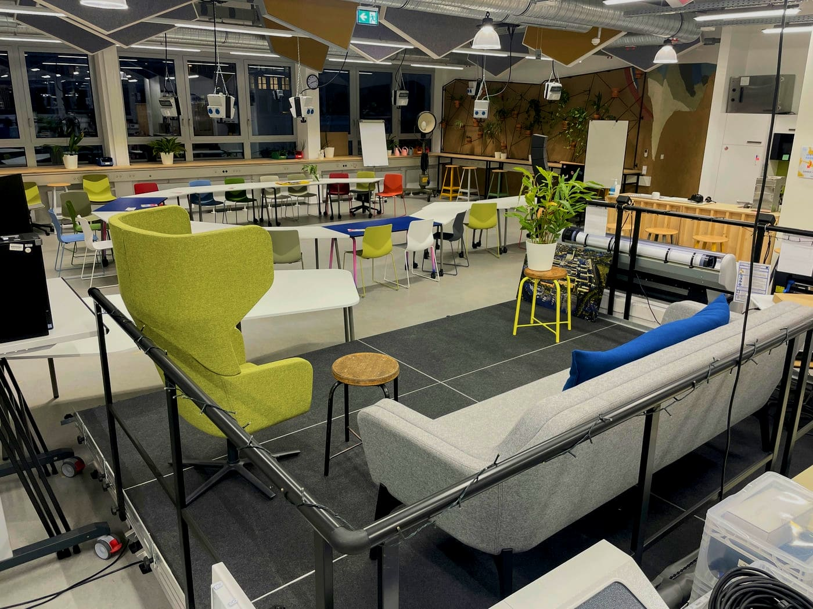

# Veranstaltungen

  

Der Makerspace hat auch außerhalb seiner Werkstätten viel Potenzial, um Menschen zusammenzubringen und ein Ort der Begegnung und des Austausches zu sein. Daher besteht als wichtiger Teil unserer [Dienstleistungen](dienstleistungen.md) die Möglichkeit, den Makerspace als interessanten und innovativen Veranstaltungsort zu buchen beziehungsweise zu mieten.
Unser Angebot reicht von der Buchung eines einzelnen Projektraumes bis hin zu einer größeren Veranstaltung inklusive Bühne. Gerne zeigen wir Dir vor Ort die Möglichkeiten; einen kleinen Einblick in unsere Veranstaltungstechnik findest Du bereits [hier](medienlabor.md#live).

!!! info "Eine kreative Umgebung"

    Der RUB-Makerspace hat seinen ganz eigenen Charme und eignet sich insbesondere für Events, bei denen eine ungewöhnliche, innovative und inspirierende Umgebung gewünscht ist.  
      
    In der Regel vermieten wir keine Werkstattflächen, diese bilden jedoch die Kulisse für Veranstaltungen. Somit bereichert ein kreatives Chaos durchaus auch einen eher förmlichen Anlass, weckt Interesse und fördert den Austausch der Gäste untereinander.

??? question "Wer ist die Ansprechperson für Veranstaltungen?"
    
    --8<--
    gki.md
    --8<--

## Möglichkeiten für Events

- In unserem [Co-Working-Bereich im Erdgeschoss](coworking.md) können je nach Bestuhlung Veranstaltungen mit bis zu etwa 100 Personen durchgeführt werden; in Kombination mit dem [Untergeschoss](coworking.md#montagezone) und dem [Innenhof](coworking.md#aussenbereich) noch deutlich mehr.
- Bühnenaufbauten für Redner\*innen, Präsentationen, Podiumsdiskussionen, Pitches und so weiter sind an verschiedenen Stellen im Makerspace möglich.
- Verschiedene große Monitore, Beamer, Funkmikrofone, Mischpult, Lautsprecher und so weiter sind vor Ort verfügbar.
- Die verschiedenen [Projekt- und Seminarräume](projektraeume.md) sowie unsere [Teeküchen](coworking.md#teekuechen) können für Events mitgenutzt werden. 
- In unserem [Küchenlabor](kuechenlabor.md) kann das Catering für einige Zeit untergebracht werden, bevor es serviert wird.
- In unserem großen [Innenhof](coworking.md#aussenbereich) mit Sitzblockstufen können ebenfalls Veranstaltungen stattfinden.
- Kleinere Veranstaltungen (bis circa 20 Personen) können flexibel in verschiedenen Bereichen im Makerspace umgesetzt werden.
- In Absprache mit der RUB-Akademie kann man für größere Veranstaltungen auch das geschichtsträchtige Foyer des ehemaligen Opel-Verwaltungsgebäudes einbeziehen.
- Unter bestimmten Umständen ist es auch möglich, unsere Werkstätten zu mieten und dort aktiv zu werden. 

Gerne bieten wir zusätzlich **Führungen** im Rahmen einer Anmietung an und erläutern bildhaft und verständlich diesen ganz besonderen Ort und was hier alles passiert. 

In Zukunft möchten wir auch Workshops, Schulungen oder Coachings für Kleingruppen anbieten. Sollte bereits jetzt Interesse an einem solchen Format im Rahmen einer Veranstaltung bei uns bestehen, teile uns dies gerne mit. Wir versuchen es dann möglich zu machen!

!!! info "[Zum Arbeitsordner ‚Veranstaltungen‘](https://ruhr-uni-bochum.sciebo.de/s/VuFDh7eChe6z1v7?path=%2FVeranstaltungen)"

    In diesem Ordner findest Du weitere Unterlagen rund um das Thema ‚Veranstaltungen im Makerspace‘.
    Wie immer gilt: Gemeinsam sind wir stärker – wir freuen uns über jeden [Beitrag zur Wissens- und Erfahrungssammlung!](feedback.md)

## Anfrage für eine Veranstaltung im Makerspace {: #anmeldung-veranstaltung }

<form method="post" action="https://feedback.ruhr-uni-bochum.de/formmailer.php" name="Kontaktformular" enctype="multipart/form-data" class="form">
    <input type="hidden" name="subject"       value="Veranstaltungs-Anfrage von der Makerspace-Homepage" />     
    <input type="hidden" name="recipients"    value="makerspace@ruhr-uni-bochum.de"/>
    <!-- 
    <input type="hidden" name="mail_options" value="CharSet=UTF-8, 
                                                    PlainTemplate=template.txt, 
                                                    TemplateMissing='', 
                                                    Exclude=realname;honigtopf;schicken;FromAddr"/> 
    -->
    <input type="hidden" name="mail_options" value="charset=UTF-8,Exclude=realname;honigtopf;schicken;FromAddr"/>
    <input type="hidden" name="good_url"      value="https://makerspace.ruhr-uni-bochum.de/danke/"  />
    
    <!-- required am Ende der Felddefinition bedeutet: Eingabe ist erforderlich> -->
    

        <label for="nachname"><strong>Name:</strong></label>
        <input name="nachname" type="text" size="40" maxlength="30" required/>
    
                          
    
    

        <label for="vorname"><strong>Vorname:</strong></label>
        <input name="vorname" type="text" size="40" maxlength="30" required/>
    
                          

    
 
        <label for="email"><strong>E-Mail:</strong></label>
        <input name="email" type="email" size="40" maxlength="60" required/>
    
          

    

        <label for="tel"><strong>Telefonnummer:</strong></label>
        <input name="tel" type="tel" size="40" maxlength="40" placeholder="Optional" />
    
  

    

    <label for="wunschdatum"><strong>Wunschdatum auswählen</strong></label>
    <input type="date" id="wunschdatum" name="wunschdatum" required>
    

    

        <label for="nachricht" id="nachricht-text"><strong>Was hast Du vor?</strong></label>
        <textarea name="nachricht" placeholder="Beschreib uns bitte kurz, worum es bei Deinem Event geht, wann es stattfinden soll und wie wir Dich dabei unterstützen können. (Limit: 2000 Zeichen)" rows="6" cols="10" style="width: 100%;" required></textarea>
    
  

    

        <label for="honigtopf"><strong>Bitte dieses Feld nicht ausfüllen:</strong></label>
        <input name="honigtopf" type="text" maxlength="50" value="" />
    
  

	

		<label for="data-privacy" style="font-size: var(--form-note-font-size);">
			

				<input type="checkbox" id="data-privacy" name="data-privacy" required>
			

			

				Ich erkläre mich mit der Erhebung, Verarbeitung und Speicherung meiner hier gemachten Angaben gemäß Eurer
				<a href="/datenschutz/index.html" target="_blank" style="color: var(--link-color);">Datenschutzvereinbarung</a> einverstanden. Meine Einwilligung kann ich jederzeit durch formlose Mitteilung an Euch widerrufen.
			

		</label>
	

    

        <input type="submit" class="md-button" value="Anfrage absenden" name="schicken" /> 
    
                          
</form>
