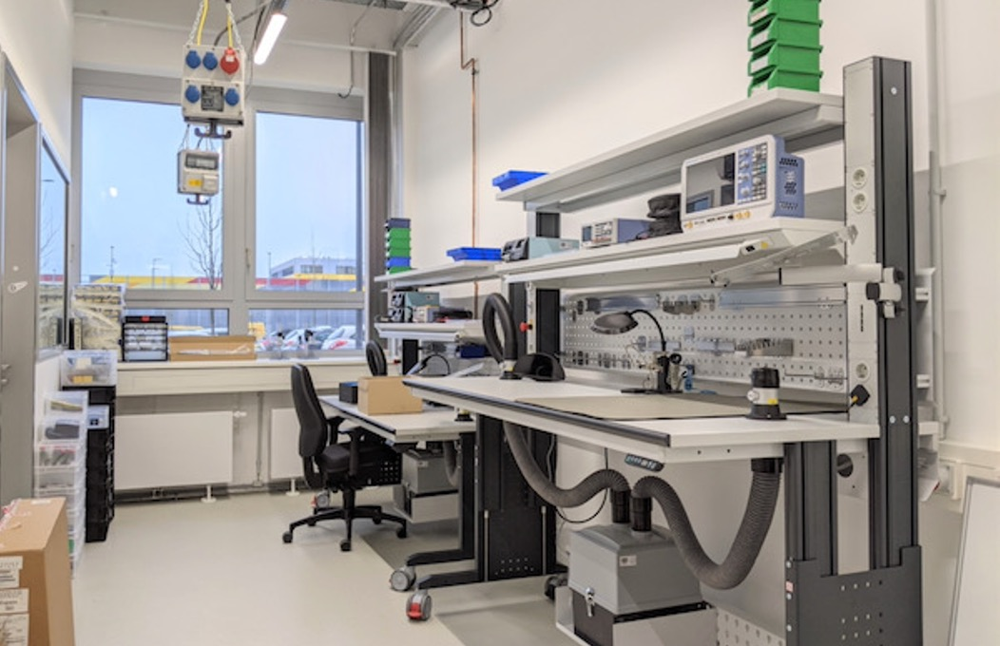

## Digitallabor RUB-Makerspace

### Sicherheits-Unterweisung

---

## Ablauf

1. **Führung Digitallabor mit Erklärung Ausstattung und Materialien**

1. Sicherheit & Grundregeln  
1. Besondere Bereiche:
    - Voltera-Platinen-Drucker
    - Löten

---

## Führung & Orientierung

 

---

### Ausstattung Technik

*Live bei Führung*

- Zwei mobile Labortische, höhenverstellbar mit u.A. Beleuchtung, Labornetzteile, Oszilloskop, Multimeter, Handwerkzeug, usw. 
- Abgesaugte Lötarbeitsplätze für 2-4 Personen

- Lötstationen mit Entlötfunktion und Heißluftlötstation
- Mikroskope & Endoskope (digital/analog)
- Platinen-"Drucker" Voltera V-One
- 10x Lötkolben + Absaugung als Workshop-Set für unterwegs
- Verschiedene Computer und IT, zum Beispiel Workshop-Set mit 9xLaptop

|||

### Ausstattung Material

*Live bei Führung*

- Verschiedene Microcontroller wie Arduinos, ESP8266/ESP32, Raspberry Pi, Adafruit Circuit Playground Express

- Gemischte allgemeine Bauteile wie LEDs, Widerstände, Transistoren, Kondensatoren
- Entwicklungs-Module wie Displays, RFID-Leser,  Steuerungen, … 
- Verschiedenste Sensoren und Aktoren
- Verbrauchsmaterial wie Kabel, Schrumpfschlauch, Stecker, etc.)
- Verbrauchsmaterial & Demo-Projekte Voltera-Platinendrucker
- Diverses "Bastelmaterial" (auch Industrie-Komponenten)

---

## Was darf ich nach heute?

Die Ausstattung und das Material des Digitallabors **darf** wie unterwiesen selbständig genutzt werden.

Es **kann** je nach Bedarf weitere Einweisungen, Erklärungen oder Projekt-Begleitung geben! Fragt bitte rege nach! 

*Die erste Nutzung der Lötarbeitsplätze und des Platinendruckers mit dem Personal abstimmen!*

---

## Verwendung von Material

1. Für nicht-destruktive Experimente vor Ort (max. ein Arbeitstag, mit Zurückräumen) darf alles verwendet werden.

2. Vor dauerhafter/destruktiver Verwendung Werkstattleitung fragen!

---

## Was im Digitallabor (nicht) passiert

### Ja:

- Arbeiten im Grenzbereich Soft-/Hardware, zum Beispiel mit Mikrocontrollern, Einplatinen-Computern, u.Ä.
- Hands-on-learning rund um IT / Hacking = Kreatives Umnutzen
- Reparatur von (Unterhaltungs-)Elektronik

### Nein: 

Arbeiten, die eine Elektrofachkraft benötigen (ohne selbst eine solche Fachkraft zu sein). Z.B. Keine Hauselektrik, keine berührungsgefährlichen Spannungen, keine DIY-Elektrofahrzeuge, Haushaltsgeräte nur bedingt, etc.

---

## Nur nicht berührungsgefährliche Spannungen! 

- Erlaubt ist das Arbeiten mit maximal: 
    - **25V Wechselspannung**
    - **60V Gleichspannung**

- Damit darf zum Beispiel auch im Schulunterricht gearbeitet werden. 
- Im Normalfall arbeiten wir im Digitallabor eher mit 3.3V, 5V, 12V
- Für "mehr Saft" ist die simple Lösung: Fertige, legale Module verwenden (geschlossene Netzteile, "Smarte" / schaltbare Steckdosen, ...) 
- Oder: Abnahme und Verantwortung durch Elektrofachkraft

---

## Arbeitssicherheit allgemein

- Vor Nutzung Betriebsanweisung und Betriebsanleitung lesen!

- Sichtkontrolle vor Nutzung eines Gerätes. Nie Geräte mit beschädigtem Kabel o.Ä. verwenden! 
- Kabel u.Ä. vernünftig verlegen (Stolperfallen, Aufbauten, …)
- Schäden immer dem Personal melden
- Ordnung! Arbeitsplatz ordentlicher verlassen als vorgefunden! :-)
- Projekte in mit Namen beschriftete Kisten sicher wegpacken

**Den gesunden Menschenverstand benutzen und aufeinander achten!**

|||

### Umgang mit Elektroschrott

- Elektroschrott gehört NICHT in den Restmüll! 

- Auch Kabel, Mehrfachsteckdosen, etc. sind Elektroschrott! 
- Der beste Müll ist der, der gar nicht entsteht:
- Dinge fürs Makerspace-Inventar gezielt ausschlachten (Aber NICHT einfach Schrott sammeln)

**In bereitgestellter Kiste sammeln**

|||

### Umgang mit Batterien

- Batterien/Akkus enthalten sehr viel Energie. Selbst wenn sie "leer" sind, reicht diese noch für ein Feuer
- Kurzschlussgefahr! Insbesondere bei loser Lagerung…
- NICHT öffnen, beschädigen oder großer Hitze aussetzen! 
- Lithium-Ionen-Akkus brennen enorm stark und sind kaum löschbar. Besondere Vorsicht beim Umgang! 

- KEIN Restmüll! Leere "normale" Batterien in bereitgestellter Kiste sammeln. 
- Pole wegen Kurzschlussgefahr abkleben
- Größere Akkus und alle Li-Ion-Akkus NUR in gelben Sicherheitskisten lagern

|||

### Elektrostatik

- Elektrostatische Aufladung ("ESD") kann empfindliche Bauteile / Schaltungen beeinflussen oder zerstören

- Das Digitallabor ist kein ESD-freier Raum, aber der Fußboden und die Drehstühle mit dem woll-artigen Polster sind ableitend. Auch auf den Labortischen gibt es ableitende Arbeitsmatten. 

*Für den “Alltagsgebrauch“ kein Problem, für fortgeschrittene Anwendungen oder Projekte ggf. relevant*

---

## Platinendrucker

- Gerät zum Rapid Prototyping von Leiterplatinen

- Kann mehrlagige Platinen drucken (mit Trenn-Tinte)
- Kann Bohren (Durchkontaktierung dann per Nieten manuell)
- Kann SMD-Bauteile direkt verlöten und die dafür erforderliche Lötpaste automatisch platzieren (Bestückung aber manuell)

|||

### Platinendrucker: Sicherheit

- Verbrauchsmaterial ist gesundheitsschädlich, muss aber nie direkt angefasst werden (Kartuschen) – ggf. Einmalhandschuhe tragen! 

- Selbstfahrend, Quetschungsgefahr – nicht in den Arbeitsbereich fassen!
- Verbrennungsgefahr an heißem Druckbett 
- Beim Bohren weitere Sicherheitsmaßnahmen erforderlich (Schutzbrille, Sicherheitsbereich, …)
- Leere Kartuschen nicht in den Restmüll! In der bereitgestellten Kiste sammeln!
- Verbrauchsmaterial im bereitgestellten Kühlschrank lagern

|||

<!-- .slide: data-background-iframe="https://makerspace.io.noc.ruhr-uni-bochum.de/homepage/sicherheit/ba-platinendrucker/" -->

|||

<!-- .slide: data-background-iframe="https://makerspace.io.noc.ruhr-uni-bochum.de/homepage/sicherheit/ba-gefahrstoffe/" -->

---

## Löten im Digitallabor: Ausstattung

- Für alle normalen Arbeiten: Weller-Lötstationen

- Normale Lötkolben mit versch. Spitzen
- Entlötpumpe (erhitzt und saugt flüssiges Zinn ab)
- Lötzinn (versch. Durchmesser vorrätig)
- Für SMD-Arbeiten: Heißluft-Lötstation
- Für Unterwegs: Set aus 10x Lötkolben & Rauchfilter
- Diverses Zubehör (Handentlötpumpe, Entlötlitze, etc.)
- Diverse Chemie auf Anfrage: Flussmittel, Schutzlacke, etc. (fortgeschritten). *Im Alltag aber eher zu vermeiden wo möglich!*

|||

## Löten im Digitallabor: Sicherheit

- Achtung, gesundheitsschädlicher Lötrauch! 

- **NUR mit Absaugung löten!** 
- Schalter f. Absaugung ist am Korpus des Absaug-Gerätes (unter den Labortischen) 
- Achtung, Verbrennungsgefahr am heißen Lötkolben und anderen erhitzten Teilen (zum Beispiel die Bauteile - "Dritte Hand" benutzen!)
- Tausch der Lötspitze in Absprache mit Personal
- Nur bleifreies Lot verwenden
- Nach dem Löten Händewaschen!

|||

<!-- .slide: data-background-iframe="https://makerspace.io.noc.ruhr-uni-bochum.de/homepage/sicherheit/ba-loeten/" -->

|||

<!-- .slide: data-background-iframe="https://makerspace.io.noc.ruhr-uni-bochum.de/homepage/sicherheit/ba-gefahrstoffe/" -->

---

## Fragen?

- **Jetzt Gelegenheit für Fragen**

- Danach: 
    - Unterweisungsformular
    - Eintrag in Fabman

---

## Danke + Kontakt!

- [makerspace@rub.de](mailto:makerspace@rub.de)  
- [instagram.com/rubmakerspace](https://instagram.com/rubmakerspace)
- [twitter.com/rubmakerspace](https://twitter.com/rubmakerspace)
- [makerspace.rub.de](https://makerspace.rub.de)

