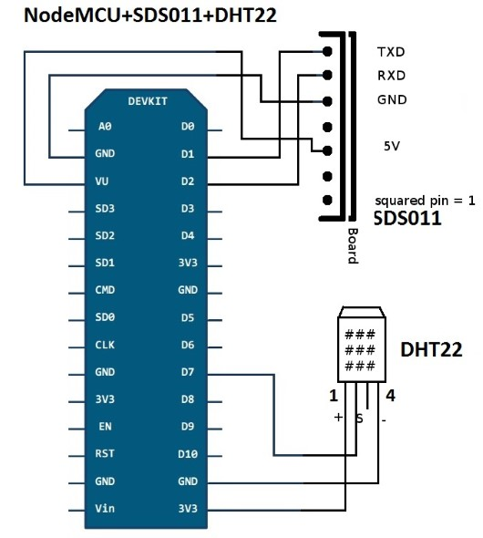
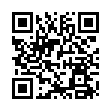

# Luftdatensensor

### Workshop zum Selbstbau

---

## Umgang mit den Folien 

- Navigiere mit den blauen Pfeilen rechts unten oder über das Menü links unten
- Tastatur: "Escape" für Folienübersicht, "f" für Fullscreen; "s" für "Speaker Notes", Pfeiltasten zur Navigation, u.v.m. (mehr: "?" für Hilfe)
- Mobilgerät: Navigation per Swipe-Gesten möglich
- Es gibt horizontale und vertikale Folien (erkennst Du an den blauen Pfeilen oder in der Folienübersicht)

---

### Intro Team & Hardware

---

### [sensor.community](https://sensor.community)<!-- .element: style="background-color:rgba(200, 200, 200, .6);" -->

<!-- .slide: data-background-iframe="https://sensor.community/de/" -->

---

### [Karte: maps.sensor.community](https://maps.sensor.community/#14/51.4760/7.2294) <!-- .element: style="background-color:rgba(200, 200, 200, .6);" -->

<!-- .slide: data-background-iframe="https://maps.sensor.community/#14/51.4760/7.2294" -->

---

### Registrierung 

- Damit euer Sensor auf der Karte mit Standort, Abstand zu Straßen, etc. zu sehen sein kann
- Keine personenbezogenen Daten erforderlich (bis auf E-Mail zur Registrierung)
- Bestätigung dauert oft ein wenig, daher als erstes

|||

https://devices.sensor.community/register 

|||

<!-- .slide: data-background-iframe="https://sensor.community/de/sensors/airrohr#Sensor_registrieren" -->

|||

Quelle: 

https://sensor.community/de/sensors/airrohr#Sensor_registrieren

---

### Software "flashen"

- Jetzt geht's an die Laptops
- Ziel: Die aktuellste Version der Luftdaten-Mess-Software auf den Microcontroller programmieren
- Verwendet wird dazu das "Firmware Flashing Tool" des Projektes

|||

<!-- .slide: data-background-iframe="https://sensor.community/de/sensors/airrohr#Firmware_Flashing_Tool" -->

|||

Quelle:

https://sensor.community/de/sensors/airrohr#Firmware_Flashing_Tool

---

### Hardware zusammenbauen! 

<small>Quelle: [Bauanleitung von sensor.community](https://sensor.community/de/sensors/airrohr/)<small>

|||

<small>Quelle: [luftdaten.info](https://sensor.community/de/sensors/airrohr/) (nicht mehr online)<small>

---

### Chip-ID herausfinden und notieren 

- Mit USB-Netzteil verbinden, Sensor strahlt dann ein eigenes WLAN aus
- **WICHTIG! Chip-ID notieren (Zahlen aus dem Namen des WLANs)!**
- Nicht alle gleichzeitig! ;-) 

---

#### WLAN-Konfiguration

- **Erst zuhause durchführen!**
- Mit dem WLAN des Sensors verbinden und Konfigurations-Seite http://192.168.4.1 aufrufen 
- Verbindungsdaten eigenes WLAN eintragen und Neustart abwarten

|||

<!-- .slide: data-background-iframe="https://sensor.community/de/sensors/airrohr#Konfiguration" -->

|||

Quelle: 

https://sensor.community/de/sensors/airrohr#Konfiguration

---

### Sensor registrieren 

Registrierung eures Sensors (und aller weiteren) über den vorher angelegten Account

https://devices.sensor.community/login

|||

<!-- .slide: data-background-iframe="https://sensor.community/de/sensors/airrohr#Sensor_registrieren" -->

|||

Quelle: 

https://sensor.community/de/sensors/airrohr#Sensor_registrieren

---

### Daten anschauen

Dashboard-Ansicht eines Sensors: 

[api-rrd.madavi.de/grafana/d/GUaL5aZMz/pm-sensors?orgId=1&theme=light&var-chipID=**DEINE-CHIP-ID**](https://api-rrd.madavi.de/grafana/d/GUaL5aZMz/pm-sensors?orgId=1&theme=light&var-chipID=DEINE-CHIP-ID) (Beispiel s. nächste Folie)

sowie auf der Karte unter: 

[maps.sensor.community](https://maps.sensor.community)

|||

<!-- .slide: data-background-iframe="https://api-rrd.madavi.de/grafana/d/GUaL5aZMz/pm-sensors?orgId=1&theme=light&var-chipID=esp8266-5683038" -->

---

Aktuelle Daten kann man auch komplett lokal aus dem eigenen WLAN vom Sensor abrufen unter: 

[http://DEINE-CHIP-ID.local/](http://DEINE-CHIP-ID.local/)

|||

<!-- .slide: data-background-iframe="https://blog.helmutkarger.de/feinstaubsensor-teil-11-datenabruf/" -->

|||

Quelle: 

https://blog.helmutkarger.de/feinstaubsensor-teil-11-datenabruf/

---

### Links

- Projekt: [sensor.community](https://sensor.community) 
- Bauanleitung: [sensor.community/de/sensors/airrohr/](https://sensor.community/de/sensors/airrohr/)
- Ausführliche Blog-Posts: [blog.helmutkarger.de/category/projekte/feinstaubsensor/](https://blog.helmutkarger.de/category/projekte/feinstaubsensor/)

---

Diese Präsentation: [makerspace.io.noc.ruhr-uni-bochum.de/website/slides/ws-luftdaten/](https://makerspace.io.noc.ruhr-uni-bochum.de/website/slides/ws-luftdaten/)  

---

## Fragen? Danke! :-) 

- [makerspace@rub.de](mailto:makerspace@rub.de)  
- [instagram.com/rubmakerspace](https://instagram.com/rubmakerspace)
- [twitter.com/rubmakerspace](https://twitter.com/rubmakerspace)
- [makerspace.rub.de](https://makerspace.rub.de)
