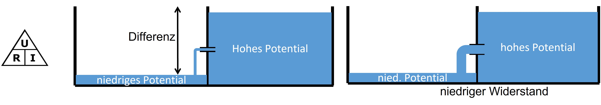
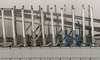
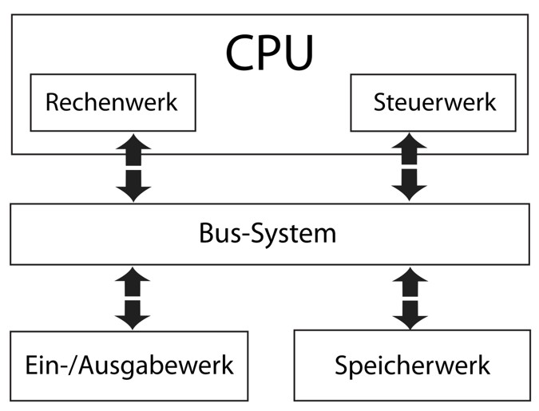

<!-- .slide: data-background-color="white" -->

<!-- # Microcontroller-Basics -->

<h1 class="r-fit-text">Microcontroller-Basics</h1>

### Im Digitallabor des RUB-Makerspace

---

<!-- .slide: data-background-color="white" -->
## Ablauf

1. Sicherheitsunterweisung
2. Input & (virtuelles) Hands-on zu Grundlagen der Elektronik für Maker
3. Input & (virtuelles) Hands-on zu Microcontrollern
4. (Echtes) Hands-on zu Microcontrollern
5. Input & Hands-on Löten

*Für die virtuellen Parts brauchen alle einen Computer mit Internet*

---

<!-- .slide: data-background-color="white" -->

## GRUNDLAGEN ELEKTRONIK

|||

<!-- .slide: data-background-color="white" -->

|||

<!-- .slide: data-background-color="white" -->

<!-- ## GRUNDBEGRIFFE  -->

<h2 class="r-fit-text">Grundbegriffe</h2>

* Strom (I), Einheit: Ampere
    * Bewegung von Ladungsträgern (z.\,B. Elektronen durch einen Leiter)

* Spannung (U), Einheit: Volt
    * Differenz des elektrischen Potentials
    * Hohe Differenz = Hohe Spannung

* Widerstand (R), Einheit: Ohm
    * „Schwierigkeit“ für den Stromfluss
    * Abhängig zum Beispiel vom Material des Leiters

|||

<!-- .slide: data-background-color="white" -->

|||

<!-- .slide: data-background-color="white" -->

## BAUTEILE (Beispiele)

* Widerstände (verändern den „Durchfluss“)
    * Fester Wert / veränderbar / umweltabhängig (zB Licht)

* Kondensatoren (speichern Energie)

* Dioden (zum Beispiel LED, die leuchten können)

* Transistoren (können Schalten oder auch Verstärken)

* … Beliebig viele komplexere Bauteile

Inductiveload: Through-Hole mounted Component
URL: https://commons.wikimedia.org/wiki/File:Through-Hole_Mounted_Component.svg (Public Domain)

Surface-mount technology (John Fader: Smt closeup, URL: https://en.wikipedia.org/wiki/File:Smt_closeup.jpg CC BY-SA 3.0)

Inductiveload: Labeled drawing of a 5mm round LED
URL: https://commons.wikimedia.org/wiki/File:LED,_5mm,_green_(en).svg (Public Domain)

Benedikt Seidl: Transistors in different housings
URL: https://commons.wikimedia.org/wiki/File:Transistors-white.jpg  (Public Domain)

|||

<!-- .slide: data-background-color="white" -->

## SCHALTUNGEN AUFBAUEN

* Freihändig verdrahten

* “Wire Wrapping“

* “Breadboarding“ (Aufbau auf Steckbrett)

* Löten (manuell / (teil-)automatisiert)

Gareth Halfacree: Adafruit PiTFT add-on board for the Raspberry Pi single board computer, (CC BY-SA 2.0) URL: https://commons.wikimedia.org/wiki/File:Adafruit_PiTFT_-_Soldering_(14675479295).jpg 

Hans Grobe: Wire Wrapping (CC BY-SA 4.0) URL: https://commons.wikimedia.org/wiki/File:Drahtwickelpistole-wires_hg.jpg

Drahkrub: Ultraschall-Mikrofonverstärker [...] Steckbrett, (CC BY-SA 4.0) URL: https://commons.wikimedia.org/wiki/File:Ultrasound-PreAmp-Breadboard.jpg

---

<!-- .slide: data-background-color="white" -->

## Hands-On mit Grundlagen der Elektronik
## (virtuell in [TinkerCAD](https://www.tinkercad.com/))

### Demo

|||

<!-- .slide: data-background-color="white" -->

### HANDS-ON (virtuell) in [TinkerCAD](https://www.tinkercad.com/)

https://www.tinkercad.com/joinclass/I6W4Z6JFD4X3 

* Option „Mit Spitzname beitreten“ wählen

* Spitznamen: rubmakerspace1, rubmakerspace2, … rubmakerspace10

* Links im Menü „Schaltkreise“ wählen. Dann „Neuen Schaltkreis erstellen“.

* Beispiele aus dem Menü Starter – „Einfach“

---

<!-- .slide: data-background-color="white" -->

### MICROCONTROLLER

* Komplexe Bauteile (u.a. viele Transistoren) als „integrated circuit“ (IC)

* Kleine Computer, programmierbar (ein-/mehrfach) 

* Haben Prozessor, Speicher, und Eingabe/Ausgabe

* Für eingebettete Anwendungen und oft für konkrete Aufgaben genutzt (dh auch: Sehr viele Modelle)

* (Extrem) günstige Modelle sind Massenware und werden überall verbaut (gibt‘s aber natürlich auch in sehr hochwertig und teuer – als CPUs in PCs zum Beispiel)

MikeMurphy: Photo of PIC 16F877A (top), PIC 16F737 (left), PIC 16F747 (middle), and US Dime for scale,
URL: https://commons.wikimedia.org/wiki/File:PIC_microcontrollers.jpg (Public Domain)

Sergey M: MC705 microcontroller
URL: https://commons.wikimedia.org/wiki/File:MC705_microcontroller_(18805409279).jpg (CC 2.0)

|||

<!-- .slide: data-background-color="white" -->

Erfurt: Modellrechenautomat TH Dresden 1958 TSD, URL: https://de.wikipedia.org/wiki/Datei:Modellrechenautomat_TH_Dresden_1958_TSD.jpg (CC BY-SA 3.0)

|||

<!-- .slide: data-background-color="white" -->

|||

<!-- .slide: data-background-color="white" -->

## INPUT/OUTPUT (I/O)

* Anschlüsse („Pins“) meist als Eingänge(I) oder Ausgänge(O) verwendbar

* zwei Hauptklassen : Digitale oder Analoge I/Os

* weitere Funktionen:
    * Stromversorgung / Erde
    * UART, zum Beispiel : Serial Kommunikation, Bluetooth
    * SPI, zum Beispiel : Master-Slave 
    * PWM (Pulsweitenmodulation)

* …

|||

<!-- .slide: data-background-color="white" -->

### ARDUINO: Microcontroller-Ökosystem für machende Menschen 

|||

<!-- .slide: data-background-color="white" -->

### VIELFALT!

* Es gibt für alle erdenklichen Zwecke passende Microcontroller und Boards

* Ganz verschiedene Leistungsklassen / Bluetooth, WiFi, integrierte Sensoren / LEDs / Displays / vernähbar / … 

* Ökosystem „Arduino“ ist mit das bekannteste (Für Bildung und „Making“)

|||
<!-- .slide: data-background-color="white" -->

### INPUT / OUTPUT (IO)

* Sensoren (Messen / repräsentieren Umgebung)

* Aktoren (Steuern Umgebung, „tun etwas“)

* Läuft über Pins (USB erstmal nur für Programmierung des Microcontrollers an sich)

|||

<!-- .slide: data-background-color="white" -->

### MICROCONTROLLER PROGRAMMIEREN

* Code wird am Computer entwickelt, dann (zum Beispiel) per USB auf den Microcontroller übertragen

* Werkzeug dafür: zum Beispiel Arduino IDE („Integrated Development Environment“)
    * Kann nicht nur Arduino-Boards sondern auch viele andere Microcontroller
    * Open Source

* Verschiedenste andere Werkzeuge (zum Beispiel auch webbasiert, s. Hands-on)

|||

<!-- .slide: data-background-color="white" -->

---

<!-- .slide: data-background-color="white" -->

## Hands-On mit Microcontrollern
## (virtuell in [TinkerCAD](https://www.tinkercad.com/))

### Demo

|||

<!-- .slide: data-background-color="white" -->

### HANDS-ON (virtuell) in [TinkerCAD](https://www.tinkercad.com/)

https://www.tinkercad.com/joinclass/I6W4Z6JFD4X3 

* Option „Mit Spitzname beiträten“ wählen

* Spitznamen: rubmakerspace1, rubmakerspace2, … rubmakerspace10

* Links im Menü „Schaltkreise“ wählen. Dann „Neuen Schaltkreis erstellen“.

* Beispiele aus dem Menü Starter – „Arduino“

---

<!-- .slide: data-background-color="white" -->

## Fragen? Danke! :-) 

- [makerspace@rub.de](mailto:makerspace@rub.de)  
- [instagram.com/rubmakerspace](https://instagram.com/rubmakerspace)
- [twitter.com/rubmakerspace](https://twitter.com/rubmakerspace)
- [makerspace.rub.de](https://makerspace.rub.de)

